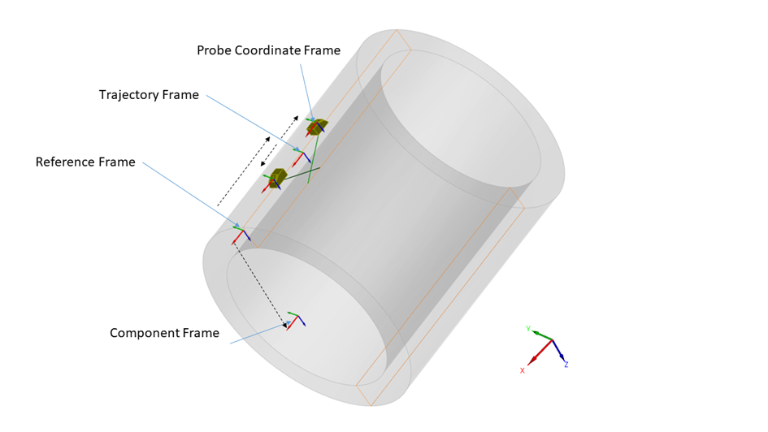
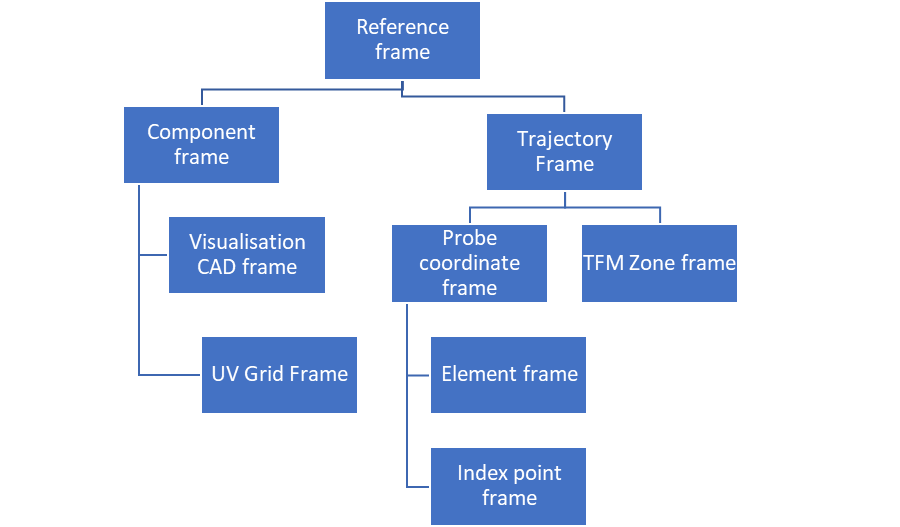
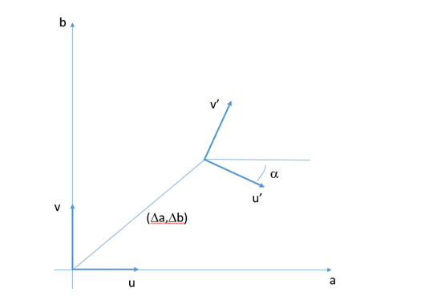

# Open NDE File Format specification - Version 0.4

# Generalities

## Preamble

  The ONDE (**Open Non Destructive Evaluation**) format results from a joint intiative by COFREND and EPRI to define a specification of open and efficient NDE
  format in order to facilitate interoperability between softwares and to ensure ability to read the data in the long term. 
  This document is therefore a technical proposal to facilitate the establishment of a neutral and open format that can
  be a good candidate for a wide standardization effort.

  The objective that was assigned to this file format is to store ultrasonic raw data to be
  able to:

  * (re)analyse it, including ultrasonic metadata required for report generation, or
  * (re)use it for further data processing, or
  * achieve interoperability between acquisition systems and analysis software.

  The objective is neither to be able to (re)produce an acquisition setup nor to (re)create a
  simulation configuration from the ultrasonic data file alone. We define as raw data the data which is produced by
  the acquisition system (AScans, TFM images, ...).

  At this stage, it was decided to stick to the data acquired and the information that is necessary to
  perform an analysis. With a few exceptions, we did not add the information that is related to the analysis procedure
  itself (information related to the display, palette, etc...). This will be addressed in future stages (information
  related to analysis, reporting, ...).

- The Working Group has analysed several existing contributions as a working basis to define an open and standardized
  file format for ultrasonic testing. Formats coming from organisations (ECUF, MFMC, DICONDE, ANDE) and commercial products (
  EVIDENT, TPAC, EDDYFI, SONATEST, CIVA) have been studied.\
  It was decided that the format would be based on the HDF5 framework, chosen for its well-established software
  ecosystem and its efficiency. The format proposal makes technical choices akin to those of the MFMC and ECUF format,
  and extends their possibilities in order to accommodate for a larger range of specimen geometries and types of data
  that are commonly encountered and were absent of the MFMC and ECUF specifications. In order to facilitate the migration
  from MFMC to ONDE, a compatibility with MFMC 2.0 specification has been added to the present specification.

- The format aims at finding the best compromise between two approaches : a very generic one with
  essentially raw geometric descriptions and a NDT oriented one with a representation of the objects familiar to the
  engineers. Considering that the transformation from NDT objects to the generic representation was straightforward, it
  was decided to systematically keep the generic representation and to allow to complement this representation with
  optional fields describing the objects in order to facilitate advanced analysis and visualisation. This approach was
  essentially adopted for three objects, namely the probe, the
  trajectory and the setup of the electronic laws.

- From an HDF5 structure perspective, architecture (flat or hierarchical) is not imposed. The relations between hdf5
  groups are translated into HDF5 references. The location of the HDF5 groups in the file is left open to the discretion of the implementor.
  The names of the groups is not imposed, the semantics of the group being defined by the mandatory TYPE attribute. 
  Only TYPE and VERSION at hdf5 root level have a location that is  imposed in the file. 
  In order to allow the proposed file format to coexist with other hdf5 file formats, the raw data (
  arrays of signals or array of images which typically represents the vast majority of the file weight) can be anywhere
  in the file structure.

- All quantities are defined with SI units. Units are therefore expressed in meters, kilograms,
  seconds. However, degrees are used instead of radians.

## Tables legend

In the following sections, the data structure is described by blocks presented in tables.

Hereafter, when pointing to ECUF and MFMC, we refer to MFMC specification document 2.0.0b[^1] and ECUF 1.0[^2].

**Variables used in structure definition:**

Definitions (derived from MFMC 2.0.0b specification)

- Ultrasonic Element -- an ultrasonic transduction device that can be excited through an electric signal externally
  driven and/or that can reversely convert ultrasound into a signal
- Ultrasonic Probe -- a collection of ultrasonic elements that are assembled together so that their relative positions
  and orientations are fixed during the acquisition process -- note that probes that possess the ability to adapt to the
  surface during the acquisition are not handled in this version of the specification
- Specimen -- object which is the subject of the inspection
- Frame -- position and orientation of a given object related to an acquisition
- Probe Element Combination (PEC) -- the system used within an MFMC structure to identify a specific element in a
  specific probe, comprising an HDF5 reference to the probe group and the index of an element in that probe;
- Focal law -- a set of instructions that specify how one or more PECs are used together;
- Transmit focal law -- a focal law relating to transmission of ultrasound from one or more PECs;
- Receive focal law -- a focal law relating to reception of ultrasound from one or more PECs;
- A-Scan -- a time-domain, ultrasonic signal (comprising amplitude measurements regularly sampled in time at a specified
  sampling frequency) that is recorded for a combination of transmit focal law and receive focal law; this can be used
  to represent both summed signals and elementary channels
- DataFrame -- a collection of coherent data obtained for a particular triggering event consisting of one of the
  following:
    - A-scans obtained using different transmit and receive focal laws for each A-scan;
    - Reconstructed images corresponding to specific reconstruction zones
    - Scalar data (peak-related or corresponding to particular post-treatments)
- Dataset -- a collection of dataframes in which all acquisition parameters are fixed from one dataframe to another;
- Ultrasonic time -- timescale over which an individual ultrasonic A-scan is recorded, which is assumed to be
  instantaneous compared to timescale associated with mechanical movement of probes;
- Propagation line -- string of connected segments representing the ultrasonic propagation for a given focal law;
- Trajectory -- set of frames representing the different position of a device;
- Acquisition grid -- particular trajectory corresponding to a cartesian grid located at the surface of a plane or
  cylindrical component;
- Image zone -- 2D or 3D regular cartesian grid used to define the reconstruction points creating the images during a
  TFM or PWI-like acquisition;

| **Variable**  | **Description**                                                          |
|---------------|--------------------------------------------------------------------------|
| N_Probes      | Number of probes                                                         |
| N_Dataset     | Number of datasets                                                       |
| N_Elem(p)   | Number of elements of p-th probe                                         |
| N_DF(m)     | Number of dataframes in m-th dataset                                     |
| N_Time(m)   | Number of time-points per A-Scan in m-th dataset                         |
| N_Ascan(m)  | Number of A-Scans per dataframe in m-th dataset                          |
| N_CS(m)     | Number of scalar values stored in the m-th CSscan dataset                |
| N_Gate(m)   | Number of gates in the m-th CScan dataset                                |
| N_Prob(m)   | Number of probes used in m-th dataset                                    |
| N_Law(m)    | Number of focal laws associated with each dataframe in the m-th dataset  |
| N_Comb(k)   | Number of probe/element combinations used in k-th focal law              |
| N_Points(k) | Number of points used to describe the k-th focal law propagation_line    |
| N_TSig(m)   | Number of time-points in the emission signal in the m-th dataset         |
| N_COL(m)    | Number of columns in the image zone for a Tscan in the m-th dataset      |
| N_ROW(m)    | Number of rows in the image zone for a Tscan in the m-th dataset         |
| N_PLANE(m)  | Number of planes in the image zone for a 3D Tscan in the m-th dataset    |
| N_U(m)      | Number of acquisition positions in the U direction for the m-th dataset  | 
| N_V(m)      | Number of acquisition positions in the V direction for the m-th dataset  |

Note : if N_U and N_V are defined (grid-like acquisition), N_DF(m) = N_U(m) x N_V(m)

## Data Model

The data model of an ONDE file is described through fields that are grouped by blocks, each block corresponding to a NDE
concept.

```mermaid
classDiagram
  ONDE_COMPONENT <|-- ONDE_2DCAD
  ONDE_COMPONENT <|-- ONDE_3DCAD
  ONDE_ACQUISITION_TRAJECTORY <|-- ONDE_ACQUISITION_GRID
  ONDE_SPATIAL_TRAJECTORY <|-- ONDE_ACQUISITION_GRID
  ONDE_COMPONENT <|-- ONDE_CYLINDER
  ONDE_UT_COUPLING <|-- ONDE_DUAL_WEDGE
  ONDE_WEDGE <|-- ONDE_DUAL_WEDGE
  ONDE_GEOMETRIC_SETUP o-- ONDE_COMPONENT : COMPONENT
  ONDE_GEOMETRIC_SETUP o-- ONDE_UT_PROBE : PROBE_LIST
  ONDE_GEOMETRIC_SETUP o-- ONDE_ACQUISITION_TRAJECTORY : ACQUISITION_TRAJECTORY
  ONDE_UT_COUPLING <|-- ONDE_IMMERSION
  ONDE_UT_PROBE <|-- ONDE_LINEAR_UT_PROBE
  ONDE_UT_PROBE <|-- ONDE_MATRIX_UT_PROBE
  ONDE_UT_PROBE <|-- ONDE_MONO_UT_PROBE
  ONDE_PHASED_ARRAY_SETUP <|-- ONDE_PHASED_ARRAY_ANGLE
  ONDE_PHASED_ARRAY_SETUP <|-- ONDE_PHASED_ARRAY_COMPOUND
  ONDE_PHASED_ARRAY_SETUP <|-- ONDE_PHASED_ARRAY_ESCAN
  ONDE_PHASED_ARRAY_SETUP <|-- ONDE_PHASED_ARRAY_FMC
  ONDE_PHASED_ARRAY_SETUP <|-- ONDE_PHASED_ARRAY_PWI
  ONDE_PHASED_ARRAY_SETUP <|-- ONDE_PHASED_ARRAY_SSCAN
  ONDE_COMPONENT <|-- ONDE_PLANE
  ONDE_SETUP o-- ONDE_ULTRASONIC_SETUP : ULTRASONIC_SETUP
  ONDE_SETUP o-- ONDE_PHASED_ARRAY_SETUP : PHASED_ARRAY_SETUP
  ONDE_SETUP o-- ONDE_GEOMETRIC_SETUP : GEOMETRIC_SETUP
  ONDE_UT_COUPLING <|-- ONDE_SINGLE_WEDGE
  ONDE_ACQUISITION_TRAJECTORY <|-- ONDE_SPATIAL_TRAJECTORY
  ONDE_ACQUISITION_TRAJECTORY <|-- ONDE_TIME_TRAJECTORY
  ONDE_UT_DATASET <|-- ONDE_UT_ASCAN_DATASET
  ONDE_UT_DATASET <|-- ONDE_UT_CSCAN_DATASET
  ONDE_UT_CSCAN_DATASET o-- ONDE_ACQUISITION_TRAJECTORY : REFERENCE_TRAJECTORY
  ONDE_UT_CSCAN_DATASET o-- ONDE_UT_GATE : GATES
  ONDE_UT_DATASET o-- ONDE_SETUP : SETUP
  ONDE_UT_PROBE o-- ONDE_UT_COUPLING : COUPLING
  ONDE_UT_DATASET <|-- ONDE_UT_TSCAN_DATASET
  ONDE_UT_TSCAN_DATASET o-- ONDE_ACQUISITION_TRAJECTORY : REFERENCE_TRAJECTORY
  ONDE_UT_TSCAN_DATASET o-- ONDE_UT_ASCAN_DATASET : ELEMENTARY_CHANNELS_DATASET
  ONDE_UT_COUPLING <|-- ONDE_WEDGE
  ONDE_COMPONENT <|-- ONDE_WELD
  click ONDE_PHASED_ARRAY_PWI href "onde_phased_array_pwi.html"
  click ONDE_PHASED_ARRAY_SSCAN href "onde_phased_array_sscan.html"
  click ONDE_IMMERSION href "onde_immersion.html"
  click ONDE_2DCAD href "onde_2dcad.html"
  click ONDE_UT_ELEMENTS href "onde_ut_elements.html"
  click ONDE_LINEAR_UT_PROBE href "onde_linear_ut_probe.html"
  click ONDE_UT_DATASET href "onde_ut_dataset.html"
  click ONDE_PHASED_ARRAY_ANGLE href "onde_phased_array_angle.html"
  click ONDE_WELD href "onde_weld.html"
  click ONDE_PHASED_ARRAY_SETUP href "onde_phased_array_setup.html"
  click ONDE_UT_CSCAN_DATASET href "onde_ut_cscan_dataset.html"
  click ONDE_PHASED_ARRAY_COMPOUND href "onde_phased_array_compound.html"
  click ONDE_ACQUISITION_TRAJECTORY href "onde_acquisition_trajectory.html"
  click ONDE_CYLINDER href "onde_cylinder.html"
  click ONDE_GEOMETRIC_SETUP href "onde_geometric_setup.html"
  click ONDE_UT_TSCAN_DATASET href "onde_ut_tscan_dataset.html"
  click ONDE_PHASED_ARRAY_ESCAN href "onde_phased_array_escan.html"
  click ONDE_SPATIAL_TRAJECTORY href "onde_spatial_trajectory.html"
  click ONDE_WEDGE href "onde_wedge.html"
  click ONDE_UT_ASCAN_DATASET href "onde_ut_ascan_dataset.html"
  click ONDE_TIME_TRAJECTORY href "onde_time_trajectory.html"
  click ONDE_MATRIX_UT_PROBE href "onde_matrix_ut_probe.html"
  click ONDE_PHASED_ARRAY_FMC href "onde_phased_array_fmc.html"
  click ROOT href "root.html"
  click ONDE_ACQUISITION_GRID href "onde_acquisition_grid.html"
  click ONDE_3DCAD href "onde_3dcad.html"
  click ONDE_DUAL_WEDGE href "onde_dual_wedge.html"
  click ONDE_UT_GATE href "onde_ut_gate.html"
  click ONDE_MONO_UT_PROBE href "onde_mono_ut_probe.html"
  click ONDE_ULTRASONIC_SETUP href "onde_ultrasonic_setup.html"
  click ONDE_COMPONENT href "onde_component.html"
  click ONDE_UT_COUPLING href "onde_ut_coupling.html"
  click ONDE_SINGLE_WEDGE href "onde_single_wedge.html"
  click ONDE_SETUP href "onde_setup.html"
  click ONDE_UT_LAW href "onde_ut_law.html"
  click ONDE_PLANE href "onde_plane.html"
  click ONDE_UT_PROBE href "onde_ut_probe.html"
```

*Figure 1: Relationships between the different blocks in the data model*

The ONDE format introduces an inheritance mechanism in order to specify the attributes that are mandatory and optional for a given group.
The diagram in Figure 1 explains the relationships between the different blocks in the data model in an UML style.

Three blocks type contain the data : namely, Ascan, Tscan and CScan (peak-like) blocks. Ascans can be used either to
describe summed signals or elementary channels data. For Cscan block, it is possible to keep the track to the raw data (
either Tscan or Ascan) from which the Cscan data originates. For Tscan blocks, it is possible to keep the track to the
elementary channels. A link to the setup can be specified : it is attached to the raw data if it is available, to the
post-processed data (Cscan or Tscan) otherwise.

The setup description is organized in two blocks defining the ultrasonic setup and the geometric setup. In the
ultrasonic setup we find the description of the electronic settings, with blocks describing the emitter and receive laws
and the phased array setup for acquisition with multielement transducers.

The geometric setup contains the dynamic description of the scene : inspected component, probes and acquisition
trajectories. It is possible to define different trajectories for different probes or to have probes sharing the same
trajectory, offsets retrieving the set of different probe positions from the trajectory.

## HDF5 implementation

### Entry points

/* TODO : update the description with Paul's description of the link between the CSV specification and the hdf5 implementation */

The blocks defined in the general structure are implemented as HDF5 groups, the name of which is free but which have a
mandatory 'TYPE' attribute that defines their nature. The entry points are the xxx_DATASET groups (namely groups that have as a TYPE attribute
 ONDE_UT_ASCAN_DATASET, ONDE_UT_TSCAN_DATASET or ONDE_UT_CSCAN_DATASET) 

When discovering the content of a given file, the following procedure must therefore be applied :

- Read the 'TYPE' and 'VERSION' attributes at root level and verify the compatibility of the version number with the
  reader, and that the type is that of a UT ONDE file ('ONDE_UT')
- Read all groups in the file and identify the groups corresponding to the datasets blocks by checking
  which groups have a 'TYPE' attribute whose value is 'ONDE_UT_ASCAN_DATASET', 'ONDE_UT_TSCAN_DATASET', 'ONDE_UT_CSCAN_DATASET'.
- From there follow the HDF5 references defined in the specification to retrieve the data arrays, the related datasets, the
  setup information, ...

### Rules for the HDF5 groups

The HDF5 implementation of the format follows the following rules :

- The extension of the HDF5 file is ".onde" (for Open Non Destructive Evaluation format)
- The block structure defined above is implemented with HDF5 groups. The name of the group is left at the discretion of
  the user. It is the mandatory TYPE attribute that defines the group type (ONDE_COMPONENT, ONDE_UT_PROBE, ONDE_ACQUISITION_TRAJECTORY,
  etc...).
- Links to other HDF5 groups are specific fields stored as HDF5 references or arrays of references.
- The following data types will be stored as attributes
    - Integers
    - Floating points
    - Strings
    - Vectors of dimension 2 or 3
- The following data types will be stored as datasets
    - Int arrays
    - Float arrays
- HDF5 polymorphism mechanism is used, so that the data can be stored with arbitrary precision (for instance, integers
  can be stored as INT16, INT32 or any user-defined integer length). The range of accessible data is implicitly defined
  by the HDF5 type. In the document, INT and FLOAT refer to this polymorphism. For instance, in the tables, an INT array
  should be interpreted as array pointing to any HDF5 integer type.
- The tables below specify the cardinality of the different HDF5 objects. For some of the table entries, we have given
  the liberty to specify one float instead of a complete vector. In this case, the same value implicitly applies to all
  elements of the vector. For example, it is allowed to provide a vector of size 1 for the frequency, instead of
  specifying the same frequency for all elements.
- For arrays (which are stored as HDF5 datasets), the tables give the dimensions of the array in row-major order (the
  last dimension corresponds to contiguous data in the file). Compression of arrays through the native compression schemes of the HDF5 libary
  (gzip3, Szip).

## Definition of frames

### 3D Frames

Figure 2 displays the different frames and convention involved in the positioning systems. The PCF (Probe Coordinate
Frame) is the frame that is related to a specific probe or set of probes. It can be arbitrarily chosen to be centered
along the piezoelectric cell, the index point, the carrier system, the Probe Center Separation for TOFD systems, etc...
Through a rigid-body offset, it is related to the Trajectory Frame (TF), which for a given position is defined in
relation to the Reference Frame. The list of these positions are defined in an Acquisition Trajectory block.

The components frames are defined in the Reference Frame.

*Figure 2: Different frames and convention involved in the positioning systems*

In the document, it was chosen to define the transformation between two frames in the shape of a vector consisting of 7
values: 3 for the offset in terms of x,y,z directions, 4 for the rotation defining the frame expressed in terms of
quaternions. The definition of rotations through quaternions was chosen because of its compactness and the absence of
ambiguity (as opposed to Euler angles which require defining an ordering of the directions).

The Wikipedia pages related to quaternion and rotation matrices provide formulae for the transition from the quaternion
shape to rotation matrices and the reverse operation: <https://en.wikipedia.org/wiki/Rotation_matrix#Quaternion>.

Throughout the document, a frame is provided for the following objects :

- The specimen frame,
- The trajectory frames (a frame for each position in the trajectory)
- The probe coordinate frames
- The elements
- The TFM Zones
- The index points

The diagram displayed in Figure 3 defines the hierarchy between these frames:

*Figure 3: Hierarchy of the frames used for the geometric representation of the objects*

### 2D Frames

In order to refer to frames on unfolded 2D surfaces, we introduce the following transformation : the transformation
between frame (O,u,v) and (O',u',v') is expressed in the (O,a,b) frame by the (∆a,∆b,α) triplet.

*Figure 4: Definition of the (∆a,∆b,α) triplet defining transformation between two 2D frames*

