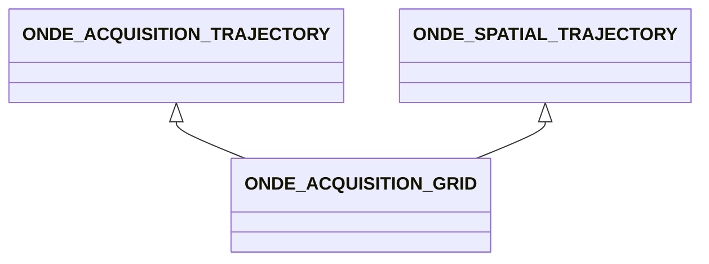

# ONDE_ACQUISITION_GRID

No narrative documentation provided for ONDE_ACQUISITION_GRID.

## Fields

<strong id="onde_acquisition_grid-type"><code>TYPE</code></strong> &mdash; 

H5T_STRING

No detailed description provided.

---

**Type:** H5T_STRING | **Dimensions:** `[3]` | **Required:** Yes | **Storage:** attribute | **Allowed:** `ONDE_ACQUISITION_TRAJECTORY","ONDE_SPATIAL_TRAJECTORY","ONDE_ACQUISITION_GRID`

<strong id="onde_acquisition_grid-reference_specimen"><code>REFERENCE_SPECIMEN</code></strong> &mdash; When defining an acquisition grid, it is necessary to define a reference specimen that is either a cylinder or a plane.

H5T_STD_REF_OBJ

When defining an acquisition grid, it is necessary to define a reference specimen that is either a cylinder or a plane.

---

**Type:** H5T_STD_REF_OBJ | **Dimensions:** `1` | **Required:** Yes | **Storage:** attribute

<strong id="onde_acquisition_grid-cylinder_definition"><code>CYLINDER_DEFINITION</code></strong> &mdash; Defines whether the grid is expressed in the inner surface of the cylinder or on the outer surface

H5T_STRING

Defines whether the grid is expressed in the inner surface of the cylinder or on the outer surface

---

**Type:** H5T_STRING | **Dimensions:** `` | **Required:** No | **Storage:** attribute | **Allowed:** `"INNER"\|"OUTER"`

<strong id="onde_acquisition_grid-uv_grid_frame"><code>UV_GRID_FRAME</code></strong> &mdash; 2D Frame defining the U_GRID and V_GRID directions of the encoding in the surface representation of the specimen (X,Y) for planar specimens, (X,THETA) for cylindrical specimens.

H5T_FLOAT

2D Frame defining the U_GRID and V_GRID directions of the encoding in the surface representation of the specimen (X,Y) for planar specimens, (X,THETA) for cylindrical specimens. (1,0,) is assumed if missing

---

**Type:** H5T_FLOAT | **Dimensions:** `[3]` | **Required:** No | **Storage:** attribute

<strong id="onde_acquisition_grid-u_grid_data"><code>U_GRID_DATA</code></strong> &mdash; The specified values of the first coder at the different positions

H5T_FLOAT

The specified values of the first coder at the different positions

---

**Type:** H5T_FLOAT | **Dimensions:** `[N_U<m>]` | **Required:** Yes | **Storage:** dataset

<strong id="onde_acquisition_grid-v_grid_data"><code>V_GRID_DATA</code></strong> &mdash; The specified values of the second coder at the different positions.

H5T_FLOAT

The specified values of the second coder at the different positions. If missing while U_GRID_DATA is present, 1D array of data is assumed.

---

**Type:** H5T_FLOAT | **Dimensions:** `[N_V<m>]` | **Required:** No | **Storage:** dataset

<strong id="onde_acquisition_grid-scan_type"><code>SCAN_TYPE</code></strong> &mdash; Defines whether the data is ordered in the same direction for each scan (COMB) or is inversed every second scan (RASTER)

H5T_STRING

Defines whether the data is ordered in the same direction for each scan (COMB) or is inversed every second scan (RASTER)

---

**Type:** H5T_STRING | **Dimensions:** `1` | **Required:** Yes | **Storage:** attribute | **Allowed:** `"COMB"\|"RASTER"`

<strong id="onde_acquisition_grid-u_encoder"><code>U_ENCODER</code></strong> &mdash; Obtained encoder values on the u axis

H5T_FLOAT

Obtained encoder values on the u axis

---

**Type:** H5T_FLOAT | **Dimensions:** `[N_V<m>,N_U<m>]` | **Required:** No | **Storage:** dataset

<strong id="onde_acquisition_grid-v_encoder"><code>V_ENCODER</code></strong> &mdash; Obtained encoder values on the v axis

H5T_FLOAT

Obtained encoder values on the v axis

---

**Type:** H5T_FLOAT | **Dimensions:** `[N_V<m>,N_U<m>]` | **Required:** No | **Storage:** dataset

<strong id="onde_acquisition_grid-probe_direction"><code>PROBE_DIRECTION</code></strong> &mdash; For grid data, direction of the probe in the (u,v,w) coordinate system.

H5T_FLOAT

For grid data, direction of the probe in the (u,v,w) coordinate system. Defaults to identity matrix.

---

**Type:** H5T_FLOAT | **Dimensions:** `[3,3]` | **Required:** No | **Storage:** dataset

