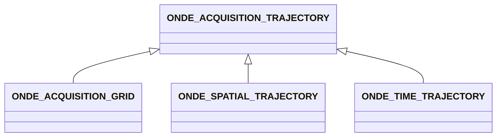

# ONDE_ACQUISITION_TRAJECTORY

No narrative documentation provided for ONDE_ACQUISITION_TRAJECTORY.

## Fields

<strong id="onde_acquisition_trajectory-type"><code>TYPE</code></strong> &mdash; 

H5T_STRING

No detailed description provided.

---

**Type:** H5T_STRING | **Dimensions:** `[1]` | **Required:** Yes | **Storage:** attribute | **Allowed:** `ONDE_ACQUISITION_TRAJECTORY`

