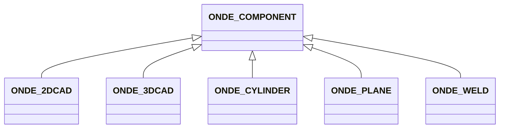
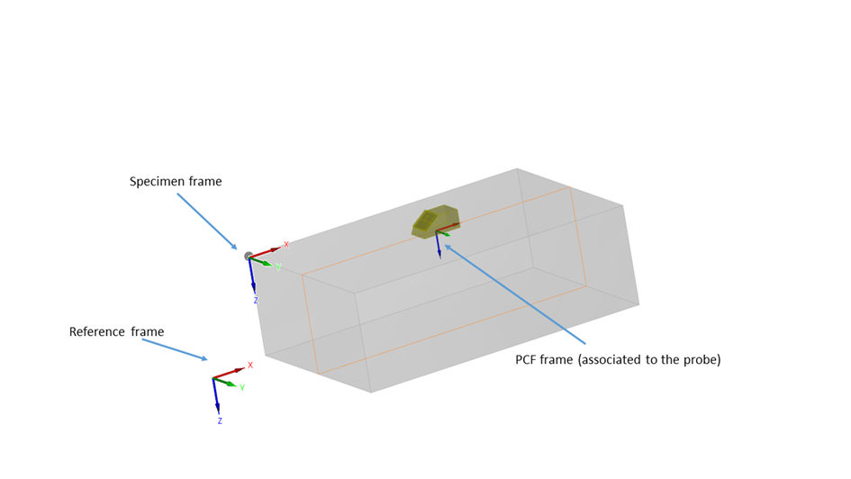
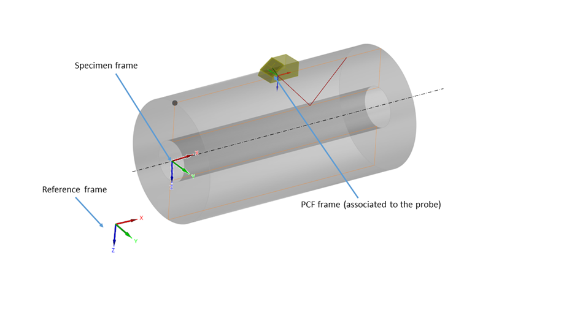
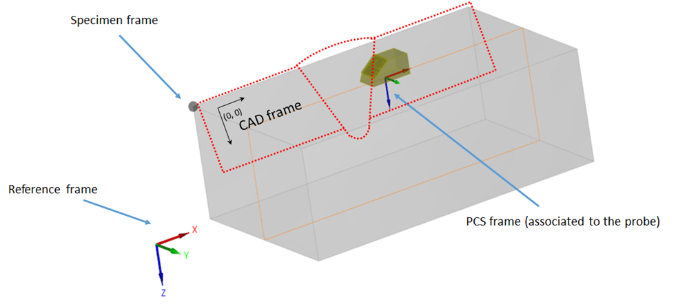
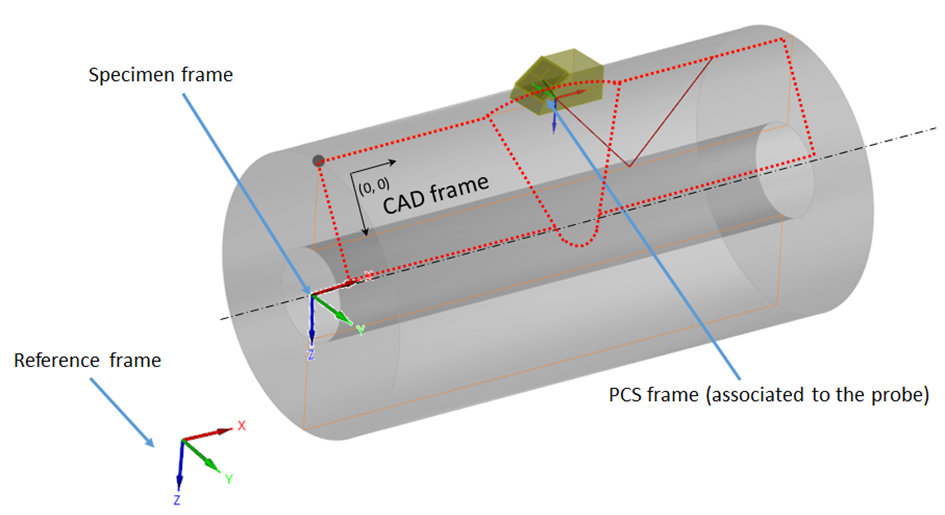

# ONDE_COMPONENT

The component block describes the inspected specimen, including its material properties, geometry, and positioning within the reference frame. This version of the format handles only isotropic materials.

The geometric shape of the inspected component is defined by the subclass of ONDE_COMPONENT. It can be one of the following: "ONDE_PLANE","ONDE_CYLINDER", "ONDE_2DCAD", "ONDE_3DCAD", "ONDE_WELD". While the format is quite generic by handling CAD files, parametric description is available for plane, cylindrical and weld specimens.

### Conventions for planar specimens
In the planar coordinate system, the z direction is defined as the one corresponding to the thickness of the inspected specimen (see Figure 6). The dimensions are given by PLATE_DIMENSIONS, as a triplet with values for length, width, and thickness.

### Conventions for cylindrical components
In the cylindrical coordinate system, the x direction is the one corresponding to the cylinder axis (see Figure 7). The dimensions are given by CYLINDER_DIMENSIONS, with a triplet for outer diameter, thickness, and length.

### Conventions for 2D CAD components
The dxf file gives, in the (X, Z) frame, the 2D CAD description of the component, either for a planar or a cylindrical extrusion. For 2D extruded components, extrusion is provided by EXTRUSION_TYPE (plane or sylindrical) and EXTRUSION_DIMENSION for the length for plane extrusion, the diameter for cylindrical ones.

For 2D CAD specimen with planar extrusion, the origin is implicitly defined as the (0,0) point in the 2D CAD sketch (see Figure 8).

For 2D CAD specimen with cylinder extrusion, the rotation is performed along the X axis of the DXF schema and the 3D origin corresponds to the projection on this axis of the 2D CAD sketch origin (see Figure 9)

### Visualization CAD Conventions
When a dxf is provided for the Visualization CAD, the extrusion of the CAD is implied from the specimen shape : it is of linear nature if the specimen is a plate or a 2D CAD with linear extrusion, it is cylindrical if the specimen is a cylinder or a 2D CAD with cylindrical extrusion.

The CAD profiles that are used for visualization are expressed in the (X,Z) plane as specified in the specimen frame.

## Fields

<strong id="onde_component-type"><code>TYPE</code></strong> &mdash; 

H5T_STRING

No detailed description provided.

---

**Type:** H5T_STRING | **Dimensions:** `` | **Required:** Yes | **Storage:** attribute | **Allowed:** `ONDE_COMPONENT`

<strong id="onde_component-label"><code>LABEL</code></strong> &mdash; 

H5T_STRING

No detailed description provided.

---

**Type:** H5T_STRING | **Dimensions:** `` | **Required:** No | **Storage:** attribute

<strong id="onde_component-velocities"><code>VELOCITIES</code></strong> &mdash; The two values of the VELOCITIES array indicate the inspected component longitudinal and shear wave velocity respectively.

H5T_FLOAT

The two values of the VELOCITIES array indicate the inspected component longitudinal and shear wave velocity respectively. If both velocities are not available, the missing one should be replaced by a NaN.

---

**Type:** H5T_FLOAT | **Dimensions:** `[2]` | **Required:** Yes | **Storage:** attribute

<strong id="onde_component-density"><code>DENSITY</code></strong> &mdash; 

H5T_FLOAT

No detailed description provided.

---

**Type:** H5T_FLOAT | **Dimensions:** `1` | **Required:** No | **Storage:** attribute

<strong id="onde_component-visualization_cad"><code>VISUALIZATION_CAD</code></strong> &mdash; VISUALISATION_CAD contains a DXF or STL file for the component visualization.

H5T_STRING

VISUALISATION_CAD contains a DXF or STL file for the component visualization. When using a dxf file, the profile will be extruded linearly or cylindrically according to the component type.

---

**Type:** H5T_STRING | **Dimensions:** `1` | **Required:** No | **Storage:** attribute

<strong id="onde_component-visualization_cad_frame"><code>VISUALIZATION_CAD_FRAME</code></strong> &mdash; Definition of the frame defining the visualisation CAD with offset and quaternions in the specimen frame- Identity is used if absent

H5T_FLOAT

Definition of the frame defining the visualisation CAD with offset and quaternions in the specimen frame- Identity is used if absent

---

**Type:** H5T_FLOAT | **Dimensions:** `[7]` | **Required:** No | **Storage:** attribute

<strong id="onde_component-component_frame"><code>COMPONENT_FRAME</code></strong> &mdash; The global coordinate system is distinct from the specimen coordinate system: 2D and 3D CAD coordinates are defined in the specimen frame and repositioned in the global coordinate system with the transformation defined in COMPONENT_FRAME.

H5T_FLOAT

The global coordinate system is distinct from the specimen coordinate system: 2D and 3D CAD coordinates are defined in the specimen frame and repositioned in the global coordinate system with the transformation defined in COMPONENT_FRAME. Default value is identity with the reference frame.

---

**Type:** H5T_FLOAT | **Dimensions:** `[7]` | **Required:** No | **Storage:** attribute

<strong id="onde_component-comment"><code>COMMENT</code></strong> &mdash; 

H5T_STRING

No detailed description provided.

---

**Type:** H5T_STRING | **Dimensions:** `1` | **Required:** No | **Storage:** attribute

<strong id="onde_component-image"><code>IMAGE</code></strong> &mdash; 

H5T_FLOAT

No detailed description provided.

---

**Type:** H5T_FLOAT | **Dimensions:** `[3]` | **Required:** No | **Storage:** attribute

