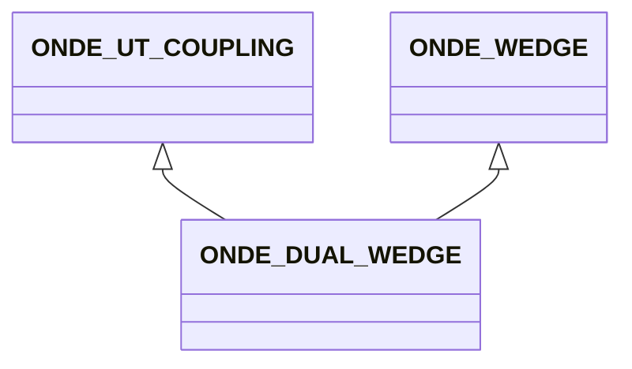

# ONDE_DUAL_WEDGE

No narrative documentation provided for ONDE_DUAL_WEDGE.

## Fields

<strong id="onde_dual_wedge-type"><code>TYPE</code></strong> &mdash; 

H5T_STRING

No detailed description provided.

---

**Type:** H5T_STRING | **Dimensions:** `[3]` | **Required:** Yes | **Storage:** attribute | **Allowed:** `ONDE_UT_COUPLING","ONDE_WEDGE","ONDE_DUAL_WEDGE`

<strong id="onde_dual_wedge-probe_separation"><code>PROBE_SEPARATION</code></strong> &mdash; For dual probes, inter-probes distance (L6) (See Figure 15)

H5T_FLOAT

For dual probes, inter-probes distance (L6) (See Figure 15)

---

**Type:** H5T_FLOAT | **Dimensions:** `1` | **Required:** Yes | **Storage:** attribute

<strong id="onde_dual_wedge-roof_angle"><code>ROOF_ANGLE</code></strong> &mdash; For dual probes and only for dual probes defines the roof angle (See Figure 15)

H5T_FLOAT

For dual probes and only for dual probes defines the roof angle (See Figure 15)

---

**Type:** H5T_FLOAT | **Dimensions:** `1` | **Required:** Yes | **Storage:** attribute

<strong id="onde_dual_wedge-squint_angle"><code>SQUINT_ANGLE</code></strong> &mdash; For dual probes, squint angle (A2) (See Figure 15)

H5T_FLOAT

For dual probes, squint angle (A2) (See Figure 15)

---

**Type:** H5T_FLOAT | **Dimensions:** `1` | **Required:** Yes | **Storage:** attribute

