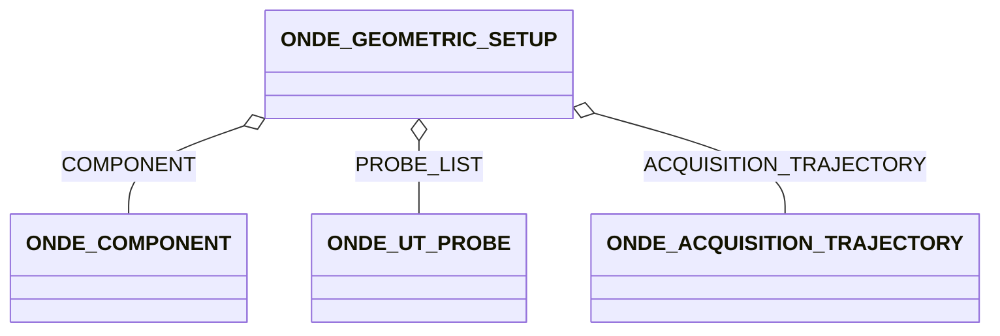

# ONDE_GEOMETRIC_SETUP

### Geometric setup

**Description**

The geometric setup contains references to the inspected component, the probes and the trajectory. If the specimen
description is missing, a semi-infinite half-plane is assumed, with interface at z=0 and material for z>0.

**Trajectories**

ACQUISITION_TRAJECTORY gives references to the groups describing the trajectory -- references have the same order as
PROBE_LIST. PROBE_COORDINATE_FRAME can be used to define an offset between a referenced trajectory and the probe -
identity is assumed if not provided.

## Fields

<strong id="onde_geometric_setup-type"><code>TYPE</code></strong> &mdash; 

H5T_STRING

No detailed description provided.

---

**Type:** H5T_STRING | **Dimensions:** `` | **Required:** Yes | **Storage:** attribute | **Allowed:** `ONDE_GEOMETRIC_SETUP`

<strong id="onde_geometric_setup-component"><code>COMPONENT</code></strong> &mdash; Reference to the inspected component.

H5T_STD_REF_OBJ&lt;[ONDE_COMPONENT](onde_component.md)&gt;

Reference to the inspected component. If missing, semi-infinite half plane is assumed, with interface at z=0 and material for z>0

---

**Type:** H5T_STD_REF_OBJ&lt;[ONDE_COMPONENT](onde_component.md)&gt; | **Dimensions:** `[1]` | **Required:** No | **Storage:** dataset

<strong id="onde_geometric_setup-probe_list"><code>PROBE_LIST</code></strong> &mdash; List all probes used in the acquisition of the dataset

H5T_STD_REF_OBJ&lt;[ONDE_UT_PROBE](onde_ut_probe.md)&gt;

List all probes used in the acquisition of the dataset

---

**Type:** H5T_STD_REF_OBJ&lt;[ONDE_UT_PROBE](onde_ut_probe.md)&gt; | **Dimensions:** `[N_Prob<M>]` | **Required:** Yes | **Storage:** dataset

<strong id="onde_geometric_setup-acquisition_trajectory"><code>ACQUISITION_TRAJECTORY</code></strong> &mdash; References  to the block describing the trajectory – references have the same order as PROBE_LIST

H5T_STD_REF_OBJ&lt;[ONDE_ACQUISITION_TRAJECTORY](onde_acquisition_trajectory.md)&gt;

References  to the block describing the trajectory – references have the same order as PROBE_LIST

---

**Type:** H5T_STD_REF_OBJ&lt;[ONDE_ACQUISITION_TRAJECTORY](onde_acquisition_trajectory.md)&gt; | **Dimensions:** `[N_Prob<M>]` | **Required:** Yes | **Storage:** dataset

<strong id="onde_geometric_setup-probe_coordinate_frame"><code>PROBE_COORDINATE_FRAME</code></strong> &mdash; Offset and direction of the probe w.

H5T_FLOAT

Offset and direction of the probe w.r.t the trajectory frame- identity  is assumed if not provided

---

**Type:** H5T_FLOAT | **Dimensions:** `[N_Prob<M>,7]` | **Required:** No | **Storage:** dataset

