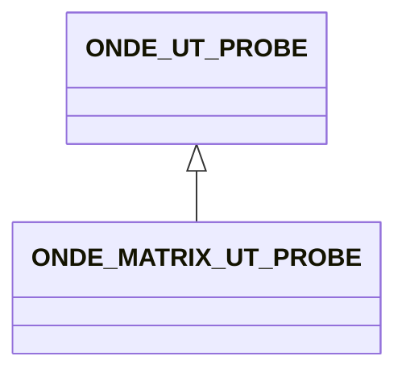

# ONDE_MATRIX_UT_PROBE

No narrative documentation provided for ONDE_MATRIX_UT_PROBE.

## Fields

<strong id="onde_matrix_ut_probe-type"><code>TYPE</code></strong> &mdash; 

H5T_STRING

No detailed description provided.

---

**Type:** H5T_STRING | **Dimensions:** `[2]` | **Required:** Yes | **Storage:** attribute | **Allowed:** `ONDE_UT_PROBE","ONDE_MATRIX_UT_PROBE`

<strong id="onde_matrix_ut_probe-total_number_of_elements"><code>TOTAL_NUMBER_OF_ELEMENTS</code></strong> &mdash; 

H5T_INTEGER

No detailed description provided.

---

**Type:** H5T_INTEGER | **Dimensions:** `1` | **Required:** Yes | **Storage:** attribute

<strong id="onde_matrix_ut_probe-number_of_elements_dim_minor"><code>NUMBER_OF_ELEMENTS_DIM_MINOR</code></strong> &mdash; 

H5T_INTEGER

No detailed description provided.

---

**Type:** H5T_INTEGER | **Dimensions:** `1` | **Required:** Yes | **Storage:** attribute

<strong id="onde_matrix_ut_probe-element_dim_major"><code>ELEMENT_DIM_MAJOR</code></strong> &mdash; 

H5T_FLOAT

No detailed description provided.

---

**Type:** H5T_FLOAT | **Dimensions:** `1` | **Required:** Yes | **Storage:** attribute

<strong id="onde_matrix_ut_probe-element_dim_minor"><code>ELEMENT_DIM_MINOR</code></strong> &mdash; 

H5T_FLOAT

No detailed description provided.

---

**Type:** H5T_FLOAT | **Dimensions:** `1` | **Required:** Yes | **Storage:** attribute

<strong id="onde_matrix_ut_probe-element_pitch_dim_major"><code>ELEMENT_PITCH_DIM_MAJOR</code></strong> &mdash; 

H5T_FLOAT

No detailed description provided.

---

**Type:** H5T_FLOAT | **Dimensions:** `1` | **Required:** Yes | **Storage:** attribute

<strong id="onde_matrix_ut_probe-element_pitch_dim_minor"><code>ELEMENT_PITCH_DIM_MINOR</code></strong> &mdash; 

H5T_FLOAT

No detailed description provided.

---

**Type:** H5T_FLOAT | **Dimensions:** `1` | **Required:** Yes | **Storage:** attribute

<strong id="onde_matrix_ut_probe-element_numbering"><code>ELEMENT_NUMBERING</code></strong> &mdash; Defines the element numbering relating the numbering implicitly defined by the probe description and the order defined in the element tables (ELEMENT_POSITION, ELEMENT_GEOMETRY, etc

Defines the element numbering relating the numbering implicitly defined by the probe description and the order defined in the element tables (ELEMENT_POSITION, ELEMENT_GEOMETRY, etc

---

**Type:**  | **Dimensions:** `` | **Required:** No | **Storage:** 

