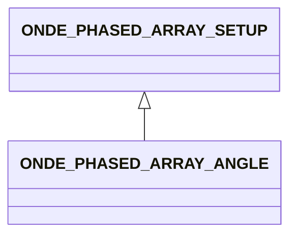

# ONDE_PHASED_ARRAY_ANGLE

In this configuration, a single angle is provided for the specification of the ultrasonic ray direction.

## Fields

<strong id="onde_phased_array_angle-type"><code>TYPE</code></strong> &mdash; 

H5T_STRING

No detailed description provided.

---

**Type:** H5T_STRING | **Dimensions:** `[2]` | **Required:** Yes | **Storage:** attribute | **Allowed:** `ONDE_PHASED_ARRAY_SETUP","ONDE_PHASED_ARRAY_ANGLE`

<strong id="onde_phased_array_angle-bscan_angle"><code>BSCAN_ANGLE</code></strong> &mdash; 

H5T_FLOAT

No detailed description provided.

---

**Type:** H5T_FLOAT | **Dimensions:** `1` | **Required:** Yes | **Storage:** attribute

