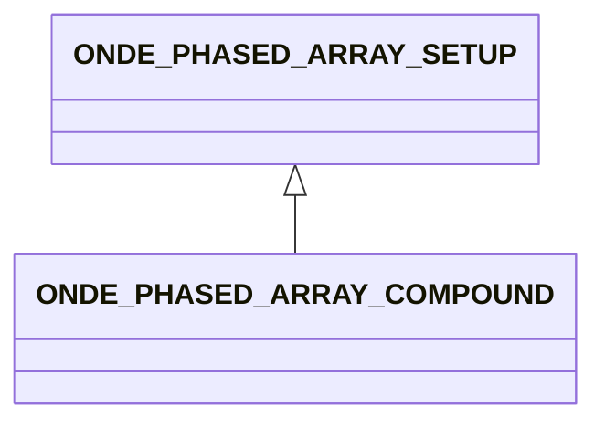

# ONDE_PHASED_ARRAY_COMPOUND

The compound type mixes Escan and Sscan behavior. COMPOUND_INITIAL_ANGLE, COMPOUND_FINAL_ANGLE and COMPOUND_NUMBER_OF_ANGLES give the angle scope, while COMPOUND_NUMBER_OF_ELEMENTS gives the number of elements in the electronic scanning.

## Fields

<strong id="onde_phased_array_compound-type"><code>TYPE</code></strong> &mdash; 

H5T_STRING

No detailed description provided.

---

**Type:** H5T_STRING | **Dimensions:** `[2]` | **Required:** Yes | **Storage:** attribute | **Allowed:** `ONDE_PHASED_ARRAY_SETUP","ONDE_PHASED_ARRAY_COMPOUND`

<strong id="onde_phased_array_compound-initial_angle"><code>INITIAL_ANGLE</code></strong> &mdash; 

H5T_FLOAT

No detailed description provided.

---

**Type:** H5T_FLOAT | **Dimensions:** `1` | **Required:** Yes | **Storage:** attribute

<strong id="onde_phased_array_compound-final_angle"><code>FINAL_ANGLE</code></strong> &mdash; 

H5T_FLOAT

No detailed description provided.

---

**Type:** H5T_FLOAT | **Dimensions:** `1` | **Required:** Yes | **Storage:** attribute

<strong id="onde_phased_array_compound-number_of_angles"><code>NUMBER_OF_ANGLES</code></strong> &mdash; 

H5T_INTEGER

No detailed description provided.

---

**Type:** H5T_INTEGER | **Dimensions:** `1` | **Required:** Yes | **Storage:** attribute

<strong id="onde_phased_array_compound-number_of_elements"><code>NUMBER_OF_ELEMENTS</code></strong> &mdash; 

H5T_INTEGER

No detailed description provided.

---

**Type:** H5T_INTEGER | **Dimensions:** `1` | **Required:** Yes | **Storage:** attribute

