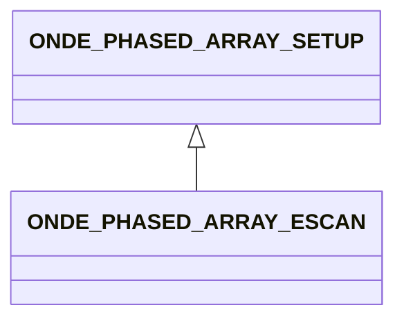

# ONDE_PHASED_ARRAY_ESCAN

In this configuration consecutive subsets of elements are used in order to form a beam at a specific angle, thus forming a sweeping set of ultrasonic beams. Figure 26 illustrates an Escan for 4 consecutive elements with a step of 3 elements on a 32 element linear transducer.

## Fields

<strong id="onde_phased_array_escan-type"><code>TYPE</code></strong> &mdash; 

H5T_STRING

No detailed description provided.

---

**Type:** H5T_STRING | **Dimensions:** `[2]` | **Required:** Yes | **Storage:** attribute | **Allowed:** `ONDE_PHASED_ARRAY_SETUP","ONDE_PHASED_ARRAY_ESCAN`

<strong id="onde_phased_array_escan-number_of_elements"><code>NUMBER_OF_ELEMENTS</code></strong> &mdash; 

H5T_INTEGER

No detailed description provided.

---

**Type:** H5T_INTEGER | **Dimensions:** `1` | **Required:** Yes | **Storage:** attribute

<strong id="onde_phased_array_escan-step"><code>STEP</code></strong> &mdash; 

H5T_INTEGER

No detailed description provided.

---

**Type:** H5T_INTEGER | **Dimensions:** `1` | **Required:** Yes | **Storage:** attribute

<strong id="onde_phased_array_escan-angle"><code>ANGLE</code></strong> &mdash; 

H5T_FLOAT

No detailed description provided.

---

**Type:** H5T_FLOAT | **Dimensions:** `1` | **Required:** Yes | **Storage:** attribute

