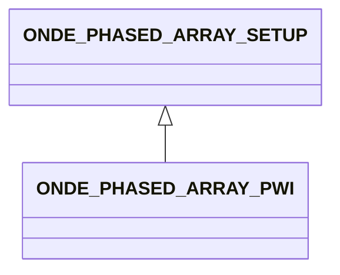

# ONDE_PHASED_ARRAY_PWI

No narrative documentation provided for ONDE_PHASED_ARRAY_PWI.

## Fields

<strong id="onde_phased_array_pwi-type"><code>TYPE</code></strong> &mdash; 

H5T_STRING

No detailed description provided.

---

**Type:** H5T_STRING | **Dimensions:** `[2]` | **Required:** Yes | **Storage:** attribute | **Allowed:** `ONDE_PHASED_ARRAY_SETUP","ONDE_PHASED_ARRAY_PWI`

<strong id="onde_phased_array_pwi-starting_angle"><code>STARTING_ANGLE</code></strong> &mdash; 

H5T_FLOAT

No detailed description provided.

---

**Type:** H5T_FLOAT | **Dimensions:** `1` | **Required:** Yes | **Storage:** attribute

<strong id="onde_phased_array_pwi-finishing_angle"><code>FINISHING_ANGLE</code></strong> &mdash; 

H5T_FLOAT

No detailed description provided.

---

**Type:** H5T_FLOAT | **Dimensions:** `1` | **Required:** Yes | **Storage:** attribute

<strong id="onde_phased_array_pwi-number_of_angles"><code>NUMBER_OF_ANGLES</code></strong> &mdash; 

H5T_INTEGER

No detailed description provided.

---

**Type:** H5T_INTEGER | **Dimensions:** `1` | **Required:** Yes | **Storage:** attribute

