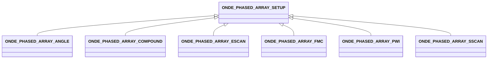

# ONDE_PHASED_ARRAY_SETUP

The phased array setup block describes the high-level electronic configuration for Phased Array ultrasonic testing. This optional group has no vocation to be exhaustive in terms of electronic configurations (unlike the law block that permits any description and is fully generic). However, it is intended to cover most of the situations that are common in industrial controls and represent a large share of the acquisition files produced in the industry. In this version of the specification, it encompasses only the most basic setups.

The specific sequencing (Angle, SScan, EScan, Compound, FMC, PWI) is defined by subclasses of this block. The propagation mode used for the settings is given in SEQUENCE_ANGLE_MODE.

## Fields

<strong id="onde_phased_array_setup-type"><code>TYPE</code></strong> &mdash; 

H5T_STRING

No detailed description provided.

---

**Type:** H5T_STRING | **Dimensions:** `` | **Required:** Yes | **Storage:** attribute | **Allowed:** `ONDE_PHASED_ARRAY_SETUP`

<strong id="onde_phased_array_setup-emitter_probe"><code>EMITTER_PROBE</code></strong> &mdash; 

H5T_STD_REF_OBJ

No detailed description provided.

---

**Type:** H5T_STD_REF_OBJ | **Dimensions:** `1` | **Required:** Yes | **Storage:** attribute

<strong id="onde_phased_array_setup-receiving_probe"><code>RECEIVING_PROBE</code></strong> &mdash; 

H5T_STD_REF_OBJ

No detailed description provided.

---

**Type:** H5T_STD_REF_OBJ | **Dimensions:** `1` | **Required:** Yes | **Storage:** attribute

<strong id="onde_phased_array_setup-sequence_angle_mode"><code>SEQUENCE_ANGLE_MODE</code></strong> &mdash; 

H5T_INTEGER

No detailed description provided.

---

**Type:** H5T_INTEGER | **Dimensions:** `` | **Required:** Yes | **Storage:** attribute | **Allowed:** `"L"\|"T"`

