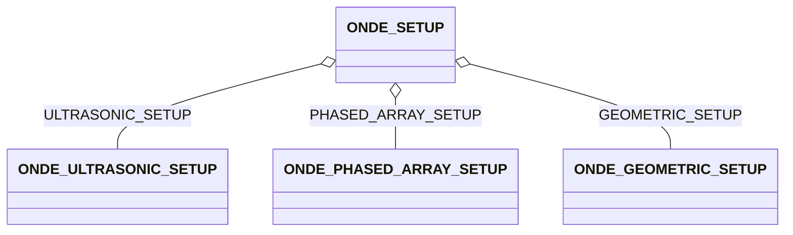

# ONDE_SETUP

### Setup

**Setup**

This group contains references to the geometric setup and ultrasonic setup. The reference to the ultrasonic setup is
compulsory for the A-scan data. For TScans, it is allowed to bypass this ultrasonic setup and have a direct reference to
the phased array setup (in order to store the reconstruction information without storing the information related to the
acquisition).

## Fields

<strong id="onde_setup-type"><code>TYPE</code></strong> &mdash; 

H5T_STRING

No detailed description provided.

---

**Type:** H5T_STRING | **Dimensions:** `` | **Required:** Yes | **Storage:** attribute | **Allowed:** `ONDE_SETUP`

<strong id="onde_setup-ultrasonic_setup"><code>ULTRASONIC_SETUP</code></strong> &mdash; Mandatory for Ascan sequences

H5T_STD_REF_OBJ&lt;[ONDE_ULTRASONIC_SETUP](onde_ultrasonic_setup.md)&gt;

Mandatory for Ascan sequences

---

**Type:** H5T_STD_REF_OBJ&lt;[ONDE_ULTRASONIC_SETUP](onde_ultrasonic_setup.md)&gt; | **Dimensions:** `[1]` | **Required:** No | **Storage:** attribute

<strong id="onde_setup-phased_array_setup"><code>PHASED_ARRAY_SETUP</code></strong> &mdash; 

H5T_STD_REF_OBJ&lt;[ONDE_PHASED_ARRAY_SETUP](onde_phased_array_setup.md)&gt;

No detailed description provided.

---

**Type:** H5T_STD_REF_OBJ&lt;[ONDE_PHASED_ARRAY_SETUP](onde_phased_array_setup.md)&gt; | **Dimensions:** `[1]` | **Required:** No | **Storage:** attribute

<strong id="onde_setup-geometric_setup"><code>GEOMETRIC_SETUP</code></strong> &mdash; 

H5T_STD_REF_OBJ&lt;[ONDE_GEOMETRIC_SETUP](onde_geometric_setup.md)&gt;

No detailed description provided.

---

**Type:** H5T_STD_REF_OBJ&lt;[ONDE_GEOMETRIC_SETUP](onde_geometric_setup.md)&gt; | **Dimensions:** `[1]` | **Required:** Yes | **Storage:** attribute

