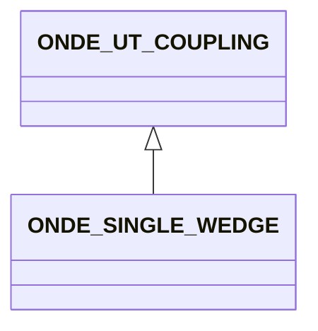

# ONDE_SINGLE_WEDGE

No narrative documentation provided for ONDE_SINGLE_WEDGE.

## Fields

<strong id="onde_single_wedge-type"><code>TYPE</code></strong> &mdash; 

H5T_STRING [3]

No detailed description provided.

---

**Type:** H5T_STRING [3] | **Dimensions:** `` | **Required:** Yes | **Storage:** attribute | **Allowed:** `ONDE_UT_COUPLING","ONDE_WEDGE","ONDE\SINGLE_WEDGE`

