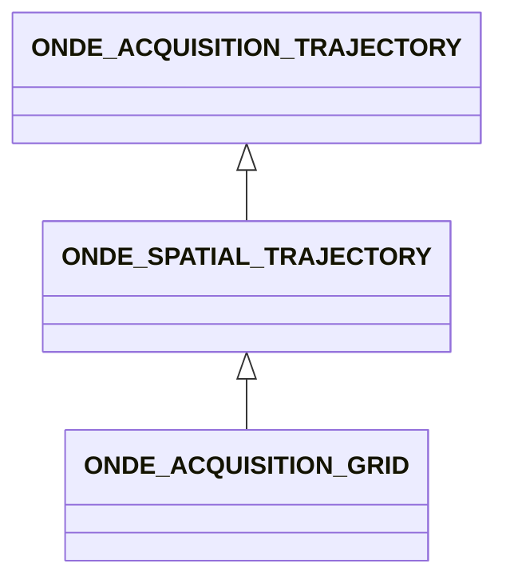

# ONDE_SPATIAL_TRAJECTORY

No narrative documentation provided for ONDE_SPATIAL_TRAJECTORY.

## Fields

<strong id="onde_spatial_trajectory-type"><code>TYPE</code></strong> &mdash; 

H5T_STRING

No detailed description provided.

---

**Type:** H5T_STRING | **Dimensions:** `[2]` | **Required:** Yes | **Storage:** attribute | **Allowed:** `ONDE_ACQUISITION_TRAJECTORY","ONDE_SPATIAL_TRAJECTORY`

<strong id="onde_spatial_trajectory-trajectory"><code>TRAJECTORY</code></strong> &mdash; List of positions and quaternions   giving the positions and orientations of the trajectory frame    at the different positions

H5T_FLOAT

List of positions and quaternions   giving the positions and orientations of the trajectory frame    at the different positions

---

**Type:** H5T_FLOAT | **Dimensions:** `[N_Pos<m>,7]` | **Required:** No | **Storage:** dataset

