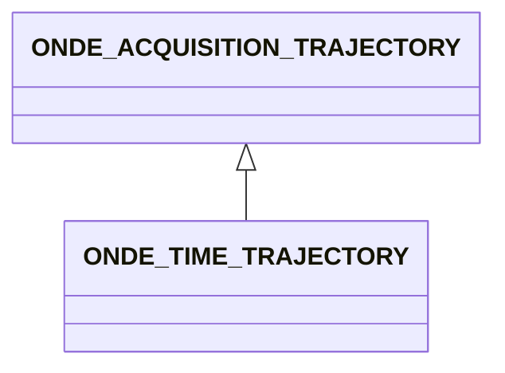

# ONDE_TIME_TRAJECTORY

No narrative documentation provided for ONDE_TIME_TRAJECTORY.

## Fields

<strong id="onde_time_trajectory-type"><code>TYPE</code></strong> &mdash; 

H5T_STRING

No detailed description provided.

---

**Type:** H5T_STRING | **Dimensions:** `[2]` | **Required:** Yes | **Storage:** attribute | **Allowed:** `ONDE_ACQUISITION_TRAJECTORY","ONDE_TIME_TRAJECTORY`

<strong id="onde_time_trajectory-acquisition_rate"><code>ACQUISITION_RATE</code></strong> &mdash; For time encoded trajectories, defines the acquisition rate

H5T_FLOAT

For time encoded trajectories, defines the acquisition rate

---

**Type:** H5T_FLOAT | **Dimensions:** `1` | **Required:** No | **Storage:** attribute

