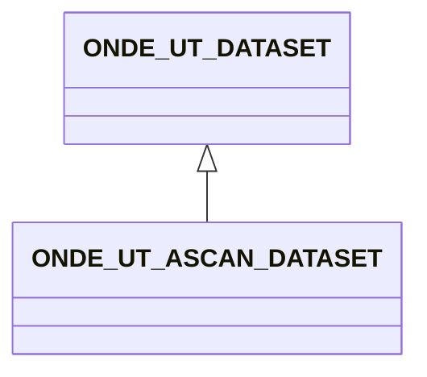

# ONDE_UT_ASCAN_DATASET

### Ascan datasets

Ascan datasets are the entry points for the description of data that is stored as time signals. The MFMC equivalent is '
SEQUENCE', and both names are allowed to ensure compatibility.

To allow continuity with existing HDF5 formats, the DATA field can be either a HDF5 dataset or a reference to a
dataset located in another part of the HDF5 structure.

## Fields

<strong id="onde_ut_ascan_dataset-type"><code>TYPE</code></strong> &mdash; 

H5T_STRING

No detailed description provided.

---

**Type:** H5T_STRING | **Dimensions:** `[2]` | **Required:** Yes | **Storage:** attribute | **Allowed:** `ONDE_UT_DATASET","ONDE_UT_ASCAN_DATASET`

<strong id="onde_ut_ascan_dataset-data"><code>DATA</code></strong> &mdash; can be either an array or a reference to an array

H5T_STD_REF_OBJ&lt;data&gt; or HT5_INTEGER or H5T_FLOAT

can be either an array or a reference to an array

---

**Type:** H5T_STD_REF_OBJ&lt;data&gt; or HT5_INTEGER or H5T_FLOAT | **Dimensions:** `1 or [N_DF<m>,N_Ascan<m>,Ntime<m>]` | **Required:** Yes | **Storage:** attribute

