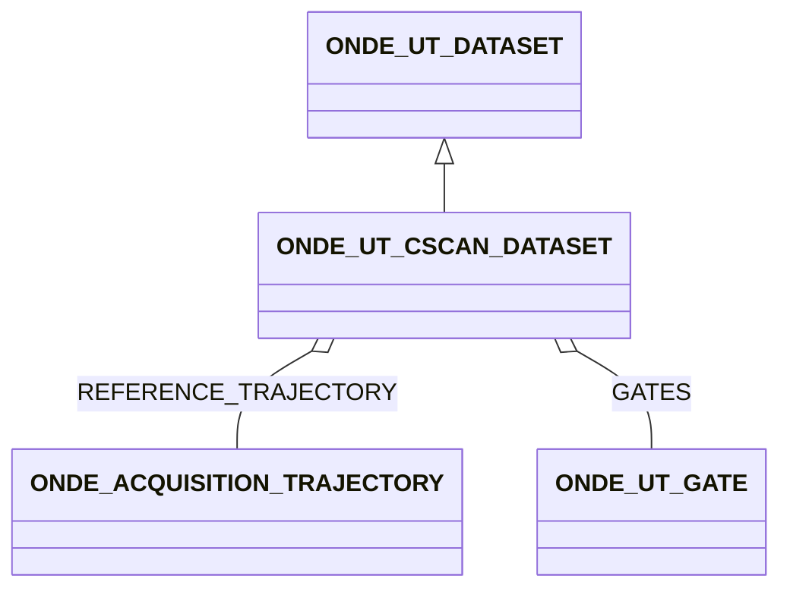

# ONDE_UT_CSCAN_DATASET

### CScan datasets and gates

**CScan data and peaks**

While this Cscan dataset is mostly meant for the storage of peak-like data (amplitude, time of flight, etc...) it is
more generic and can accommodate different values.

DATA contains a vector of references to datasets containing scalar raw data. The size of the data can be either
N_DF\<m\> x N_Ascan\<m\> arrays (for data resulting from analysis of signals or N_DF\<m\> arrays for encoder data or
data
resulting from Tscan or monoelement scans.

**Data description**

The DATATYPE field contains a name defining the nature of the data- the name can be either custom (MY_MATERIAL_PROPERTY
for instance) or a standardized name: THICKNESS, TIME_OF_FLIGHT, DEPTH, AMAX.

**Data numbering**

To be efficient for relatively small amounts of data, as opposed to other blocks, the Cscan block allows for
the handling of several data inside the block. The DATA, DATA_TYPE vectors must have the same length and be ordered
coherently.

**Data positioning**

The Cscan data can be positioned through a trajectory block which is defined in REFERENCE_TRAJECTORY.

**Underlying raw data**

UNDERLYING_DATA is used to point to the dataset that corresponds to the originating raw data. LINKED_DATASET_REFERENCE
gives the correspondence between the scalar data and the originating scan. For a A-Scan, the correspondence to the scan
is expressed in terms of (dataframe, law). For a 2D Tscan, it will be (dataframe, column), for a 3D Tscan, it will be (
dataframe, plane, column).

**Gates**

The gates are stored as a separate group of type ONDE_UT_GATE. The gates are referenced in the ONDE_UT_CSCAN_DATASET group via the 
ONDE_UT_CSCAN_DATASET:GATES field.
The gates used for the acquisition are defined through four parameters.\
GATE_START and GATE_WIDTH define the time window and GATE_THRESHOLD defines the threshold that was used to trigger the
storage of the data. GATE_DETECTION defines the type of triggering event that was used to define the gate.

## Fields

<strong id="onde_ut_cscan_dataset-type"><code>TYPE</code></strong> &mdash; 

H5T_STRING

No detailed description provided.

---

**Type:** H5T_STRING | **Dimensions:** `[2]` | **Required:** Yes | **Storage:** attribute | **Allowed:** `ONDE_UT_DATASET","ONDE_UT_CSCAN_DATASET`

<strong id="onde_ut_cscan_dataset-data"><code>DATA</code></strong> &mdash; references to arrays containing the different values stored in the dataset

H5T_STD_REF_OBJ or HT5_INTEGER

references to arrays containing the different values stored in the dataset

---

**Type:** H5T_STD_REF_OBJ or HT5_INTEGER | **Dimensions:** `[N_CS<m>] |[N_CS<m>,N_Gate<m>]` | **Required:** Yes | **Storage:** dataset

<strong id="onde_ut_cscan_dataset-datatype"><code>DATATYPE</code></strong> &mdash; string defining the stored data - the name can be either custom  (MY_MATERIAL_PROPERTY for instance) or a standardized name : THICKNESS, TIME_OF_FLIGHT, DEPTH, AMAX

H5T_STRING

string defining the stored data - the name can be either custom  (MY_MATERIAL_PROPERTY for instance) or a standardized name : THICKNESS, TIME_OF_FLIGHT, DEPTH, AMAX

---

**Type:** H5T_STRING | **Dimensions:** `[N_CS<m>]` | **Required:** Yes | **Storage:** dataset

<strong id="onde_ut_cscan_dataset-underlying_data"><code>UNDERLYING_DATA</code></strong> &mdash; reference to the dataset containing the underlying data

H5T_STD_REF_OBJ&lt;ONDE_UT_ASCAN_DATASET&gt; or H5T_STD_REF_OBJ&lt;ONDE_UT_TSCAN_DATASET&gt;

reference to the dataset containing the underlying data

---

**Type:** H5T_STD_REF_OBJ&lt;ONDE_UT_ASCAN_DATASET&gt; or H5T_STD_REF_OBJ&lt;ONDE_UT_TSCAN_DATASET&gt; | **Dimensions:** `1` | **Required:** No | **Storage:** attribute

<strong id="onde_ut_cscan_dataset-underlying_data_reference"><code>UNDERLYING_DATA_REFERENCE</code></strong> &mdash; Correspondancy between the C-Scan scalar data and the scan originating.

H5T_INTEGER

Correspondancy between the C-Scan scalar data and the scan originating. For a A-Scan, the scan is expressed in terms of (dataframe, law). For a 2D Tscan, it will be (dataframe, column), for a 3D Tscan, it will be (dataframe, plane, column)

---

**Type:** H5T_INTEGER | **Dimensions:** `[N_DF<m>,2] or [N_DF<m>,3]` | **Required:** No | **Storage:** dataset

<strong id="onde_ut_cscan_dataset-reference_trajectory"><code>REFERENCE_TRAJECTORY</code></strong> &mdash; 

H5T_STD_REF_OBJ&lt;[ONDE_ACQUISITION_TRAJECTORY](onde_acquisition_trajectory.md)&gt;

No detailed description provided.

---

**Type:** H5T_STD_REF_OBJ&lt;[ONDE_ACQUISITION_TRAJECTORY](onde_acquisition_trajectory.md)&gt; | **Dimensions:** `1` | **Required:** Yes | **Storage:** attribute

<strong id="onde_ut_cscan_dataset-gates"><code>GATES</code></strong> &mdash; 

H5T_STD_REF_OBJ&lt;[ONDE_UT_GATE](onde_ut_gate.md)&gt;

No detailed description provided.

---

**Type:** H5T_STD_REF_OBJ&lt;[ONDE_UT_GATE](onde_ut_gate.md)&gt; | **Dimensions:** `[N_Gate<m>]` | **Required:** No | **Storage:** dataset

