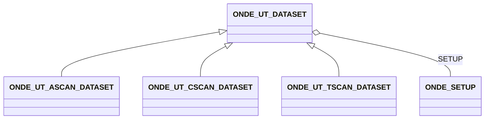

# ONDE_UT_DATASET

# Data structure

## Description of the format

/* TODO : update with the modifications introduced with subclassing and accessory classes */ 

The specification of the format is provided in a [dedicated csv file](/ONDE_fields/ONDE_fields.csv) organized in the following manner :

- The first column gives the field label and its location in the structure. The following convention applies : the name
  in bracket points to a group corresponding to a block of the data model. For example, {ascan_dataset} indicates an
  HDF5 group corresponding to an Ascan dataset.
- The second column contains comments explaining the constraints imposed on the datafield
- The third column gives a Mandatory/Optional status
- The fourth column gives the HDF5 implementation : D stands for dataset while A points to an information stored as an
  attribute.
- The fifth column gives the HDF5 type
- The sixth column gives the number of dimensions
- The seventh column provides information on the size or the content of the datafield. For a string with a value that is
  imposed, it will provide this value.\
  For other datafields, it will be the size of the data. The size is provided in brackets with dimensions separated by
  commas. The dimension of a scalar data will therefore be described by [^1]. Dimensions are provided in Fortran
  convention (column-major order).

## Explanatory notes

### Version

The file is identified as a UT ONDE file because of the TYPE datafield which is given at the root of the structure. The
version of the file points to the version of the present specification.

### Generic remarks on datasets

The DATE_AND_TIME and OPERATOR fields allow to give indication on the context of the acquisition. For DATE_AND_TIME the
ISO 8601 extended format: 'yyyy-mm-dd HH:MM:SS' (e.g. '2019-01-16 17:05:06') must be used.

### Notes on groups

The following links provide explanatory notes for the ONDE groups that are described in the [cvs reference](/ONDE_fields/ONDE_fields.csv).

[Ascan datasets](/UT_specification/ascan_datasets.md)

[Tscan datasets](/UT_specification/tscan_datasets.md)

[Cscan datasets](/UT_specification/ut_cscan_datasets.md)

[Setup](/UT_specification/setup.md)

[Geometric setup](/UT_specification/ut_geometric_setup.md)

[Components](/UT_specification/component.md)

[Probes](/UT_specification/UT_probes.md)

[Trajectory](/UT_specification/trajectory.md)

[Ultrasonic setup](/UT_specification/UT_ultrasonic_setup.md)

[Electronic Law](/UT_specification/UT_law.md)

[Phased array setup](/UT_specification/UT_phased_array_setup.md)

[^1]: P. Wilcox, MFMC Specification document 2.0.0b.
[^2]: M. Dennis, ECUF Common Ultrasonic Datafile Format, 2018 EPRI Technical Report
[^3]: S. Holland, Data Models for NDE 4.0 and NDE Digital Twin, Chapter for NDE 4.0 textbook
                                                |

# Appendix A -- conversion from quaternions to matrices

when dealing with 3D orientations, to define the quaternion corresponding to the orientation of one reference frame
relative to another, we need the following formula to calculate the components of a quaternion, q, from the elements of
a rotation matrix, R:

$q_{1} = \ \frac{1}{2}\sqrt{1 + r_{1,1} + r_{2,2} + r_{3,3}}$

$q_{2} = \ \frac{1}{2}sign(r_{3,2} - r_{2,3)}$$\sqrt{1 + r_{1,1} - r_{2,2} - r_{3,3}}$

$q_{3} = \ \frac{1}{2}sign(r_{1,3} - r_{3,1)}$$\sqrt{1 - r_{1,1} + r_{2,2} - r_{3,3}}$

$q_{4} = \ \frac{1}{2}sign(r_{2,1} - r_{1,2)}$$\sqrt{1 - r_{1,1} - r_{2,2} + r_{3,3}}$

Where

$$R\ = \ \begin{pmatrix}
r_{1,1} & r_{1,2} & r_{1,3} \\
r_{2,1} & r_{2,2} & r_{2,3} \\
r_{3,1} & r_{3,2} & r_{3,3}
\end{pmatrix}$$

If q is the unit quaternion corresponding to the rotation matrix R, then -q is the other quaternion corresponding to the
same orientation.

Similarly, if you have a unit quaternion q and want to convert it to a rotation matrix R, the formula is:

$$R\ = \ \begin{pmatrix}
2q_{1}^{2} + 2q_{2}^{2} - 1 & 2q_{2}q_{3} - 2q_{1}q_{4} & 2q_{2}q_{4} + 2q_{1}q_{3} \\
2q_{2}q_{3} + 2q_{1}q_{4} & 2q_{1}^{2} + 2q_{3}^{2} - 1 & 2q_{3}q_{4} - 2q_{1}q_{2} \\
2q_{2}q_{4} - 2q_{1}q_{3} & 2q_{3}q_{4} + 2q_{1}q_{2} & 2q_{1}^{2} + 2q_{4}^{2} - 1
\end{pmatrix}$$

*Source:[Quaternions and Rotation Sequences: A Primer with Applications to Orbits, Aerospace and Virtual Reality](https://amzn.to/2RY2lwI)
by J. B. Kuipers (Chapter 5, Section 5.14 "Quaternions to Matrices", pg. 125)*

## Fields

<strong id="onde_ut_dataset-type"><code>TYPE</code></strong> &mdash; 

H5T_STRING

No detailed description provided.

---

**Type:** H5T_STRING | **Dimensions:** `[1]` | **Required:** Yes | **Storage:** attribute | **Allowed:** `ONDE_UT_DATASET`

<strong id="onde_ut_dataset-label"><code>LABEL</code></strong> &mdash; 

H5T_STRING

No detailed description provided.

---

**Type:** H5T_STRING | **Dimensions:** `1` | **Required:** No | **Storage:** attribute

<strong id="onde_ut_dataset-setup"><code>SETUP</code></strong> &mdash; 

H5T_STD_REF_OBJ&lt;[ONDE_SETUP](onde_setup.md)&gt;

No detailed description provided.

---

**Type:** H5T_STD_REF_OBJ&lt;[ONDE_SETUP](onde_setup.md)&gt; | **Dimensions:** `1` | **Required:** Yes | **Storage:** attribute

<strong id="onde_ut_dataset-operator"><code>OPERATOR</code></strong> &mdash; 

H5T_STRING

No detailed description provided.

---

**Type:** H5T_STRING | **Dimensions:** `1` | **Required:** No | **Storage:** attribute

<strong id="onde_ut_dataset-date_and_time"><code>DATE_AND_TIME</code></strong> &mdash; 

H5T_STRING

No detailed description provided.

---

**Type:** H5T_STRING | **Dimensions:** `1` | **Required:** No | **Storage:** attribute

