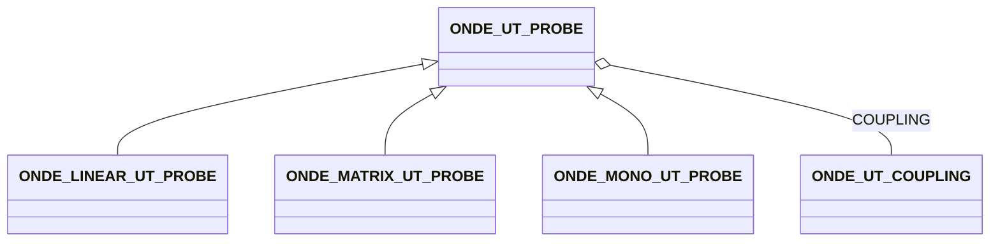

# ONDE_UT_PROBE

No narrative documentation provided for ONDE_UT_PROBE.

## Fields

<strong id="onde_ut_probe-type"><code>TYPE</code></strong> &mdash; 

H5T_STRING

No detailed description provided.

---

**Type:** H5T_STRING | **Dimensions:** `[1]` | **Required:** Yes | **Storage:** attribute | **Allowed:** `ONDE_UT_PROBE`

<strong id="onde_ut_probe-type_tags"><code>TYPE_TAGS</code></strong> &mdash; 

H5T_STRING

No detailed description provided.

---

**Type:** H5T_STRING | **Dimensions:** `[1]` | **Required:** Yes | **Storage:** attribute | **Allowed:** `ONDE_UT_ELEMENTS`

<strong id="onde_ut_probe-label"><code>LABEL</code></strong> &mdash; 

H5T_STRING

No detailed description provided.

---

**Type:** H5T_STRING | **Dimensions:** `1` | **Required:** No | **Storage:** attribute

<strong id="onde_ut_probe-index_point_frame"><code>INDEX_POINT_FRAME</code></strong> &mdash; If absent, identity is assumed

H5T_FLOAT

If absent, identity is assumed

---

**Type:** H5T_FLOAT | **Dimensions:** `[7]` | **Required:** No | **Storage:** dataset

<strong id="onde_ut_probe-manufacturer"><code>MANUFACTURER</code></strong> &mdash; 

H5T_STRING

No detailed description provided.

---

**Type:** H5T_STRING | **Dimensions:** `1` | **Required:** No | **Storage:** attribute

<strong id="onde_ut_probe-serial_number"><code>SERIAL_NUMBER</code></strong> &mdash; 

H5T_STRING

No detailed description provided.

---

**Type:** H5T_STRING | **Dimensions:** `1` | **Required:** No | **Storage:** attribute

<strong id="onde_ut_probe-frequency"><code>FREQUENCY</code></strong> &mdash; 

H5T_FLOAT

No detailed description provided.

---

**Type:** H5T_FLOAT | **Dimensions:** `1` | **Required:** Yes | **Storage:** attribute

<strong id="onde_ut_probe-bandwidth"><code>BANDWIDTH</code></strong> &mdash; 

H5T_FLOAT

No detailed description provided.

---

**Type:** H5T_FLOAT | **Dimensions:** `1` | **Required:** No | **Storage:** attribute

<strong id="onde_ut_probe-focusing_surface"><code>FOCUSING_SURFACE</code></strong> &mdash; Defines the shape of the surface on which the elements are arranged - if absent, FLAT is assumed

H5T_INTEGER

Defines the shape of the surface on which the elements are arranged - if absent, FLAT is assumed

---

**Type:** H5T_INTEGER | **Dimensions:** `` | **Required:** No | **Storage:** attribute | **Allowed:** `"FLAT"\|"CYLINDRICAL_INC"\|"CYLINDRICAL_PERP"\|"SPHERICAL"\|"BIFOCAL"\|"TRIFOCAL"`

<strong id="onde_ut_probe-focusing_surface_parameters"><code>FOCUSING_SURFACE_PARAMETERS</code></strong> &mdash; Multi values : value in mm - FLAT : no value - CYLINDRICAL_INC, CYLINDRICAL_PER : Surface radius - SPHERICAL : Surface radius - BIFOCAL : Surface radius in the incidence plane, surface radius in the plane perpendicular to the incidence plane - TRIFOCAL : Surface radius in the incidence plane (bottom), Surface radius in the incidence plane (top), surface radius in the plane perpendicular to the incidence plane.

H5T_FLOAT

Multi values : value in mm - FLAT : no value - CYLINDRICAL_INC, CYLINDRICAL_PER : Surface radius - SPHERICAL : Surface radius - BIFOCAL : Surface radius in the incidence plane, surface radius in the plane perpendicular to the incidence plane - TRIFOCAL : Surface radius in the incidence plane (bottom), Surface radius in the incidence plane (top), surface radius in the plane perpendicular to the incidence plane.

---

**Type:** H5T_FLOAT | **Dimensions:** `[3]` | **Required:** No | **Storage:** attribute

<strong id="onde_ut_probe-coupling"><code>COUPLING</code></strong> &mdash; Reference to the coupling system (wedge, immersion, direct)

H5T_STD_REF_OBJ&lt;[ONDE_UT_COUPLING](onde_ut_coupling.md)&gt;

Reference to the coupling system (wedge, immersion, direct)

---

**Type:** H5T_STD_REF_OBJ&lt;[ONDE_UT_COUPLING](onde_ut_coupling.md)&gt; | **Dimensions:** `1` | **Required:** Yes | **Storage:** attribute

