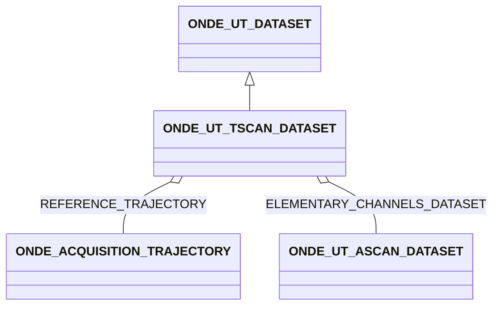
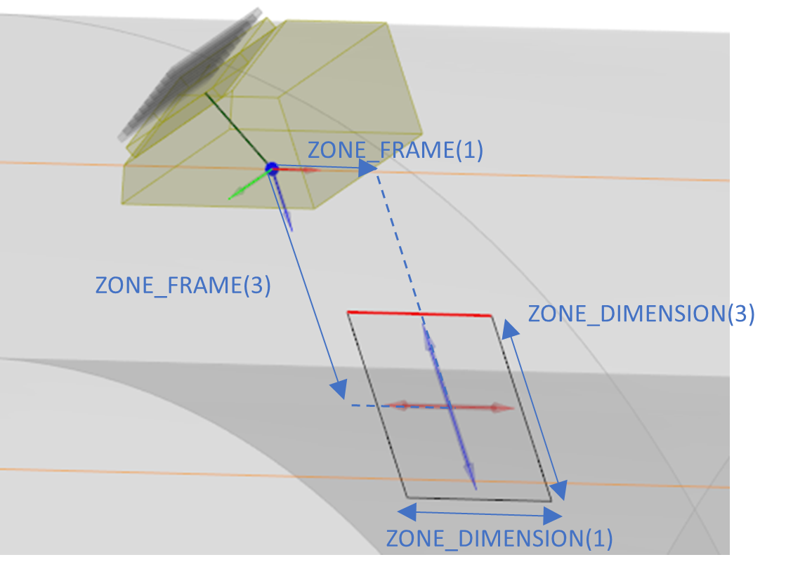

# ONDE_UT_TSCAN_DATASET

### Tscan datasets

**General**

Even though the name (Tscans coming from TFM Scans) implicitly refers to the TFM reconstruction images, the block can
apply to any reconstruction method producing data on a rectangular/parallelepiped grid that moves with the sensor (be it
obtained by TFM, Adaptive TFM, PWI, Adaptive PWI, frequency reconstruction, or any variant of these methods)

**3D Zones**

The format allows for the description of 3D zones. Taking into account the dimension related to positions, this implies
that the dimension of the data array depends on the zone dimension (3D array for 2D zones 4D array for 3D zones),

**Zone dimension and position**

The zone physical dimension is given by the ZONE_DIMENSION field, (DX,DY,DZ) being the physical dimensions of the zone,
a zero or a NaN for one of the dimension implies a 2D zone.

ZONE_SIZE is a triplet which gives the number of pixels of the zone for each dimension (NX,NY,NZ).

The zone position is given by ZONE_FRAME and is expressed relatively to the trajectory frame pointed to by
REFERENCE_TRAJECTORY.

*Figure 5: Example of TFM zone positioning*

In the example displayed in Figure 5, the trajectory frame is located at the index point and the zone is positioned
accordingly.

**Pixel ordering**

The pixels are stored in the (X,Y,Z) order (X being the outer loop, Z the inner loop in the array)

## Fields

<strong id="onde_ut_tscan_dataset-type"><code>TYPE</code></strong> &mdash; 

H5T_STRING

No detailed description provided.

---

**Type:** H5T_STRING | **Dimensions:** `[2]` | **Required:** Yes | **Storage:** attribute | **Allowed:** `ONDE_UT_DATASET","ONDE_UT_TSCAN_DATASET`

<strong id="onde_ut_tscan_dataset-data"><code>DATA</code></strong> &mdash; can be either an array or a reference to an array

H5T_STD_REF_OBJ or HT5_INTEGER

can be either an array or a reference to an array

---

**Type:** H5T_STD_REF_OBJ or HT5_INTEGER | **Dimensions:** `1 or [N_DF<m>,N_ROW<m>,N_COL<m>] or [N_DF<m>,NROW<m>,NCOL<m>,N_PLANE<m>]` | **Required:** Yes | **Storage:** attribute

<strong id="onde_ut_tscan_dataset-reference_trajectory"><code>REFERENCE_TRAJECTORY</code></strong> &mdash; 

H5T_STD_REF_OBJ&lt;[ONDE_ACQUISITION_TRAJECTORY](onde_acquisition_trajectory.md)&gt;

No detailed description provided.

---

**Type:** H5T_STD_REF_OBJ&lt;[ONDE_ACQUISITION_TRAJECTORY](onde_acquisition_trajectory.md)&gt; | **Dimensions:** `1` | **Required:** Yes | **Storage:** attribute

<strong id="onde_ut_tscan_dataset-zone_frame"><code>ZONE_FRAME</code></strong> &mdash; frame associated with the center of the image zone

H5T_FLOAT

frame associated with the center of the image zone

---

**Type:** H5T_FLOAT | **Dimensions:** `[7]` | **Required:** Yes | **Storage:** attribute

<strong id="onde_ut_tscan_dataset-zone_dimension"><code>ZONE_DIMENSION</code></strong> &mdash; physical dimension of the zone

H5T_FLOAT

physical dimension of the zone

---

**Type:** H5T_FLOAT | **Dimensions:** `[3]` | **Required:** Yes | **Storage:** attribute

<strong id="onde_ut_tscan_dataset-zone_size"><code>ZONE_SIZE</code></strong> &mdash; number of pixels of the zone

H5T_INTEGER

number of pixels of the zone

---

**Type:** H5T_INTEGER | **Dimensions:** `[3]` | **Required:** Yes | **Storage:** attribute

<strong id="onde_ut_tscan_dataset-reconstruction_mode"><code>RECONSTRUCTION_MODE</code></strong> &mdash; 

H5T_STRING

No detailed description provided.

---

**Type:** H5T_STRING | **Dimensions:** `1` | **Required:** No | **Storage:** attribute

<strong id="onde_ut_tscan_dataset-elementary_channels_dataset"><code>ELEMENTARY_CHANNELS_DATASET</code></strong> &mdash; optional reference to the elementary channels ascans that were used for the reconstruction

H5T_STD_REF_OBJ&lt;[ONDE_UT_ASCAN_DATASET](onde_ut_ascan_dataset.md)&gt;

optional reference to the elementary channels ascans that were used for the reconstruction

---

**Type:** H5T_STD_REF_OBJ&lt;[ONDE_UT_ASCAN_DATASET](onde_ut_ascan_dataset.md)&gt; | **Dimensions:** `1` | **Required:** No | **Storage:** attribute

