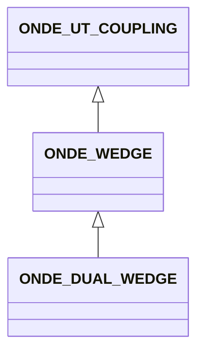

# ONDE_WEDGE

No narrative documentation provided for ONDE_WEDGE.

## Fields

<strong id="onde_wedge-type"><code>TYPE</code></strong> &mdash; 

H5T_STRING

No detailed description provided.

---

**Type:** H5T_STRING | **Dimensions:** `[2]` | **Required:** Yes | **Storage:** attribute | **Allowed:** `ONDE_UT_COUPLING","ONDE_WEDGE`

<strong id="onde_wedge-label"><code>LABEL</code></strong> &mdash; 

H5T_STRING

No detailed description provided.

---

**Type:** H5T_STRING | **Dimensions:** `1` | **Required:** No | **Storage:** attribute

<strong id="onde_wedge-manufacturer"><code>MANUFACTURER</code></strong> &mdash; 

H5T_STRING

No detailed description provided.

---

**Type:** H5T_STRING | **Dimensions:** `1` | **Required:** No | **Storage:** attribute

<strong id="onde_wedge-serial_number"><code>SERIAL_NUMBER</code></strong> &mdash; 

H5T_STRING

No detailed description provided.

---

**Type:** H5T_STRING | **Dimensions:** `1` | **Required:** No | **Storage:** attribute

<strong id="onde_wedge-contact_surface"><code>CONTACT_SURFACE</code></strong> &mdash; Type of the wedge contact surface - PLANAR, SPHERICAL, CYLINDRICAL_MAJOR, CYLINDRICAL_MINOR - If missing PLANAR assumed

H5T_STRING

Type of the wedge contact surface - PLANAR, SPHERICAL, CYLINDRICAL_MAJOR, CYLINDRICAL_MINOR - If missing PLANAR assumed

---

**Type:** H5T_STRING | **Dimensions:** `` | **Required:** Yes | **Storage:** attribute | **Allowed:** `"PLANAR"\|"SPHERICAL"\|"CYLINDRICAL_MAJOR"\|"CYLINDRICAL_MINOR"`

<strong id="onde_wedge-curvature_radius"><code>CURVATURE_RADIUS</code></strong> &mdash; Wedge curvature radius - Concave : positive - Convex : negative - 0 in the case of a planar wedge - If missing 0 assumed.

H5T_FLOAT

Wedge curvature radius - Concave : positive - Convex : negative - 0 in the case of a planar wedge - If missing 0 assumed.

---

**Type:** H5T_FLOAT | **Dimensions:** `1` | **Required:** No | **Storage:** attribute

<strong id="onde_wedge-contact_area"><code>CONTACT_AREA</code></strong> &mdash; Equivalent to L1, L2 and L3 (See Figure 15)

H5T_FLOAT

Equivalent to L1, L2 and L3 (See Figure 15)

---

**Type:** H5T_FLOAT | **Dimensions:** `[3]` | **Required:** Yes | **Storage:** attribute

<strong id="onde_wedge-height"><code>HEIGHT</code></strong> &mdash; For a wedge, distance of the ultrasonic beam between the probe center and the index point (See Figure 15)

H5T_FLOAT

For a wedge, distance of the ultrasonic beam between the probe center and the index point (See Figure 15)

---

**Type:** H5T_FLOAT | **Dimensions:** `1` | **Required:** Yes | **Storage:** attribute

<strong id="onde_wedge-skew_angle"><code>SKEW_ANGLE</code></strong> &mdash; wedge /skew angle (B) (See Figure 15)

H5T_FLOAT

wedge /skew angle (B) (See Figure 15)

---

**Type:** H5T_FLOAT | **Dimensions:** `1` | **Required:** No | **Storage:** attribute

<strong id="onde_wedge-disorientation_angle"><code>DISORIENTATION_ANGLE</code></strong> &mdash; wedge /disorientation angle (D) (See Figure 15)

H5T_FLOAT

wedge /disorientation angle (D) (See Figure 15)

---

**Type:** H5T_FLOAT | **Dimensions:** `1` | **Required:** No | **Storage:** attribute

