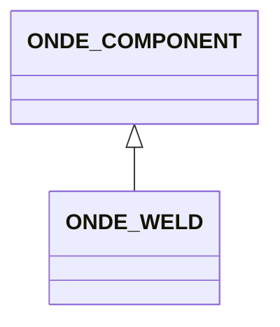

# ONDE_WELD

No narrative documentation provided for ONDE_WELD.

## Fields

<strong id="onde_weld-type"><code>TYPE</code></strong> &mdash; 

H5T_STRING

No detailed description provided.

---

**Type:** H5T_STRING | **Dimensions:** `[2]` | **Required:** Yes | **Storage:** attribute | **Allowed:** `ONDE_COMPONENT","ONDE_WELD`

<strong id="onde_weld-extrusion_type"><code>EXTRUSION_TYPE</code></strong> &mdash; 

H5T_STRING

No detailed description provided.

---

**Type:** H5T_STRING | **Dimensions:** `1` | **Required:** Yes | **Storage:** attribute | **Allowed:** `"PLANE" \|"CYLINDER"`

<strong id="onde_weld-extrusion_dimension"><code>EXTRUSION_DIMENSION</code></strong> &mdash; 

H5T_FLOAT

No detailed description provided.

---

**Type:** H5T_FLOAT | **Dimensions:** `1` | **Required:** Yes | **Storage:** attribute

<strong id="onde_weld-weld_type"><code>WELD_TYPE</code></strong> &mdash; 

H5T_STRING

No detailed description provided.

---

**Type:** H5T_STRING | **Dimensions:** `1` | **Required:** Yes | **Storage:** attribute | **Allowed:** `"V"\|"U"`

<strong id="onde_weld-weld_symmetry"><code>WELD_SYMMETRY</code></strong> &mdash; 

H5T_STRING

No detailed description provided.

---

**Type:** H5T_STRING | **Dimensions:** `1` | **Required:** Yes | **Storage:** attribute | **Allowed:** `"SYMMETRIC"\|"STRAIGHT_LEFT"\|"STRAIGHT_RIGHT"`

<strong id="onde_weld-weld_upper_cap_width"><code>WELD_UPPER_CAP_WIDTH</code></strong> &mdash; 

H5T_FLOAT

No detailed description provided.

---

**Type:** H5T_FLOAT | **Dimensions:** `1` | **Required:** Yes | **Storage:** attribute

<strong id="onde_weld-weld_upper_cap_height"><code>WELD_UPPER_CAP_HEIGHT</code></strong> &mdash; 

H5T_FLOAT

No detailed description provided.

---

**Type:** H5T_FLOAT | **Dimensions:** `1` | **Required:** Yes | **Storage:** attribute

<strong id="onde_weld-weld_fill_angle"><code>WELD_FILL_ANGLE</code></strong> &mdash; 

H5T_FLOAT

No detailed description provided.

---

**Type:** H5T_FLOAT | **Dimensions:** `1` | **Required:** Yes | **Storage:** attribute

<strong id="onde_weld-weld_fill_height"><code>WELD_FILL_HEIGHT</code></strong> &mdash; 

H5T_FLOAT

No detailed description provided.

---

**Type:** H5T_FLOAT | **Dimensions:** `1` | **Required:** Yes | **Storage:** attribute

<strong id="onde_weld-weld_hot_pass_angle"><code>WELD_HOT_PASS_ANGLE</code></strong> &mdash; 

H5T_FLOAT

No detailed description provided.

---

**Type:** H5T_FLOAT | **Dimensions:** `1` | **Required:** Yes | **Storage:** attribute

<strong id="onde_weld-weld_hot_pass_height"><code>WELD_HOT_PASS_HEIGHT</code></strong> &mdash; 

H5T_FLOAT

No detailed description provided.

---

**Type:** H5T_FLOAT | **Dimensions:** `1` | **Required:** Yes | **Storage:** attribute

<strong id="onde_weld-weld_land_offset"><code>WELD_LAND_OFFSET</code></strong> &mdash; 

H5T_FLOAT

No detailed description provided.

---

**Type:** H5T_FLOAT | **Dimensions:** `1` | **Required:** Yes | **Storage:** attribute

<strong id="onde_weld-weld_land_height"><code>WELD_LAND_HEIGHT</code></strong> &mdash; 

H5T_FLOAT

No detailed description provided.

---

**Type:** H5T_FLOAT | **Dimensions:** `1` | **Required:** Yes | **Storage:** attribute

<strong id="onde_weld-weld_root_angle"><code>WELD_ROOT_ANGLE</code></strong> &mdash; 

H5T_FLOAT

No detailed description provided.

---

**Type:** H5T_FLOAT | **Dimensions:** `1` | **Required:** Yes | **Storage:** attribute

<strong id="onde_weld-weld_root_height"><code>WELD_ROOT_HEIGHT</code></strong> &mdash; 

H5T_FLOAT

No detailed description provided.

---

**Type:** H5T_FLOAT | **Dimensions:** `1` | **Required:** Yes | **Storage:** attribute

<strong id="onde_weld-weld_lower_cap_height"><code>WELD_LOWER_CAP_HEIGHT</code></strong> &mdash; 

H5T_FLOAT

No detailed description provided.

---

**Type:** H5T_FLOAT | **Dimensions:** `1` | **Required:** Yes | **Storage:** attribute

<strong id="onde_weld-weld_lower_cap_width"><code>WELD_LOWER_CAP_WIDTH</code></strong> &mdash; 

H5T_FLOAT

No detailed description provided.

---

**Type:** H5T_FLOAT | **Dimensions:** `1` | **Required:** Yes | **Storage:** attribute

<strong id="onde_weld-weld_haz_width"><code>WELD_HAZ_WIDTH</code></strong> &mdash; 

H5T_FLOAT

No detailed description provided.

---

**Type:** H5T_FLOAT | **Dimensions:** `1` | **Required:** No | **Storage:** attribute

