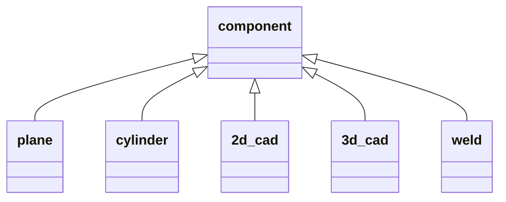

---
# ============================================================
# ONDE Class Definition — Machine-Parseable Metadata
# ============================================================
onde_class: ONDE_COMPONENT
version: "0.4.0"
inherits: []
subclasses:
  - ONDE_PLANE
  - ONDE_CYLINDER
  - ONDE_2DCAD
  - ONDE_3DCAD
  - ONDE_WELD
see_also:
  - ONDE_GEOMETRIC_SETUP
compatibility:
  MFMC: "Equivalent to SPECIMEN block in MFMC 2.0.0b"
---

# ONDE_COMPONENT

The component block describes the inspected specimen, including its material
properties, geometry, and positioning within the reference frame. This version
of the format handles only isotropic materials.

The geometric shape of the inspected component is defined by the subclass of
`ONDE_COMPONENT`. It can be one of the following: `ONDE_PLANE`, `ONDE_CYLINDER`,
`ONDE_2DCAD`, `ONDE_3DCAD`, `ONDE_WELD`. While the format is quite generic by
handling CAD files, parametric description is available for plane, cylindrical,
and weld specimens. Other parameterized shapes can be added in future versions.

## Field Definitions

<!-- MACHINE-PARSEABLE: This table is the authoritative field schema for this class. -->
<!-- Automated tools extract field definitions from this table. -->

| Field | Required | Storage | Type | Dimensions | Units | Default | Brief Description |
|---|---|---|---|---|---|---|---|
| `ONDE:TYPE` | M | Attribute | `H5T_STRING` | | | | Class type identifier |
| `ONDE:LABEL` | O | Attribute | `H5T_STRING` | | | | Human-readable label |
| `VELOCITIES` | M | Attribute | `H5T_FLOAT` | `[2]` | m/s | | Longitudinal and shear wave velocities |
| `DENSITY` | O | Attribute | `H5T_FLOAT` | `1` | kg/m³ | | Material density |
| `VISUALIZATION_CAD` | O | Attribute | `H5T_STRING` | `1` | | | DXF or STL file for visualization |
| `VISUALIZATION_CAD_FRAME` | O | Attribute | `H5T_FLOAT` | `[7]` | | identity | Frame defining visualization CAD position |
| `COMPONENT_FRAME` | O | Attribute | `H5T_FLOAT` | `[7]` | | identity | Specimen frame in the reference frame |
| `COMMENT` | O | Attribute | `H5T_STRING` | `1` | | | Free-form comment |
| `IMAGE` | O | Attribute | `H5T_FLOAT` | `[3]` | | | Image reference |

## Detailed Field Documentation

### VELOCITIES

The two values of the `VELOCITIES` array indicate the inspected component
longitudinal and shear wave velocity respectively. If both velocities
(Longitudinal and Shear) are not available, the missing one should be replaced
by a NaN.

> **Limitation:** This version of the format handles only isotropic materials.

### VISUALIZATION_CAD

`VISUALIZATION_CAD` contains a DXF or STL file for the component visualization.
When using a DXF file, the profile will be extruded linearly or cylindrically
according to the component type.

### VISUALIZATION_CAD_FRAME

Definition of the frame defining the visualization CAD with offset and
quaternions in the specimen frame. Identity is used if absent.

See the [frame conventions](../../UT_specification/UT_file_format.md#definition-of-frames)
section for details on the 7-value frame representation (3 offset + 4 quaternion).

### COMPONENT_FRAME

Definition of the specimen frame in the reference frame. If not provided, the
default value is identity with the reference frame.

## Notes

### Conventions for planar specimens

In the planar coordinate system, the z direction is defined as the one
corresponding to the thickness of the inspected specimen (see Figure 6). The
dimensions are given by `PLATE_DIMENSIONS`, as a triplet with values for
length, width, and thickness.

*Figure 6: Trajectory planar coordinate system convention*

### Conventions for cylindrical components

In the cylindrical coordinate system, the x direction is the one corresponding
to the cylinder axis (see Figure 7). The dimensions are given by
`CYLINDER_DIMENSIONS`, with a triplet for outer diameter, thickness, and length.

*Figure 7: Trajectory cylindrical coordinate system convention*

### Conventions for 2D CAD components

The DXF file gives, in the (X, Z) frame, the 2D CAD description of the
component, either for a planar or a cylindrical extrusion. For 2D extruded
components, extrusion is provided by `EXTRUSION_TYPE` (plane or cylindrical)
and `EXTRUSION_DIMENSION` for the length for plane extrusion, the diameter for
cylindrical ones.

For 2D CAD specimen with planar extrusion, the origin is implicitly defined as
the (0,0) point in the 2D CAD sketch (see Figure 8).

*Figure 8: Convention for the description of a 2D CAD component with planar extrusion*

For 2D CAD specimen with cylinder extrusion, the rotation is performed along
the X axis of the DXF schema and the 3D origin corresponds to the projection
on this axis of the 2D CAD sketch origin (see Figure 9).

*Figure 9: Convention for the description of a 2D CAD component with cylinder extrusion*

### Visualization CAD

When a DXF is provided for the Visualization CAD, the extrusion of the CAD is
implied from the specimen shape: it is of linear nature if the specimen is a
plate or a 2D CAD with linear extrusion, it is cylindrical if the specimen is
a cylinder or a 2D CAD with cylindrical extrusion.

*Figure 10: Convention for the positioning of the visualization CAD in a planar component*

*Figure 11: Convention for the positioning of the visualization CAD in a cylindrical component*

### Transformations

The global coordinate system is distinct from the specimen coordinate system:
for example, 2D and 3D CAD coordinates are defined in the specimen frame and
repositioned in the global coordinate system with the transformation defined
in `COMPONENT_FRAME`.

---

# ONDE_PLANE

---
<!-- Subclass metadata (parsed alongside the parent) -->
<!-- onde_class: ONDE_PLANE -->
<!-- inherits: [ONDE_COMPONENT] -->
---

A planar component. Inherits all fields from [ONDE_COMPONENT](#onde_component).

For plane components, the dimensions are given by `PLATE_DIMENSIONS`, with a
triplet for length, width, and height.

## Field Definitions

| Field | Required | Storage | Type | Dimensions | Units | Default | Brief Description |
|---|---|---|---|---|---|---|---|
| `ONDE:TYPE` | M | Attribute | `H5T_STRING` | `[2]` | | `["ONDE_COMPONENT","ONDE_PLANE"]` | Type chain including parent |
| `PLATE_DIMENSIONS` | M | Attribute | `H5T_FLOAT` | `[3]` | m | | Length, width, thickness |

---

# ONDE_CYLINDER

---
<!-- onde_class: ONDE_CYLINDER -->
<!-- inherits: [ONDE_COMPONENT] -->
---

A cylindrical component. Inherits all fields from [ONDE_COMPONENT](#onde_component).

For cylindrical components, the dimensions are given by `DIMENSIONS`, with a
triplet for outer diameter, thickness, and length.

## Field Definitions

| Field | Required | Storage | Type | Dimensions | Units | Default | Brief Description |
|---|---|---|---|---|---|---|---|
| `ONDE:TYPE` | M | Attribute | `H5T_STRING` | `[2]` | | `["ONDE_COMPONENT","ONDE_CYLINDER"]` | Type chain including parent |
| `DIMENSIONS` | M | Attribute | `H5T_FLOAT` | `[3]` | m | | Outer diameter, thickness, length |
